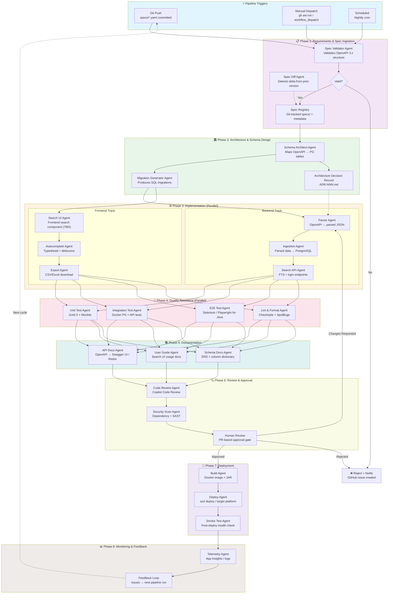
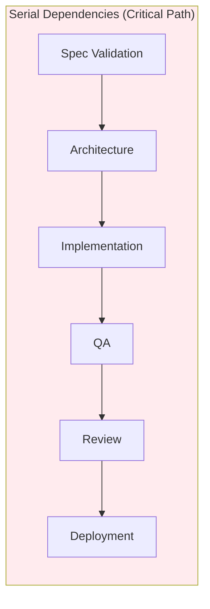
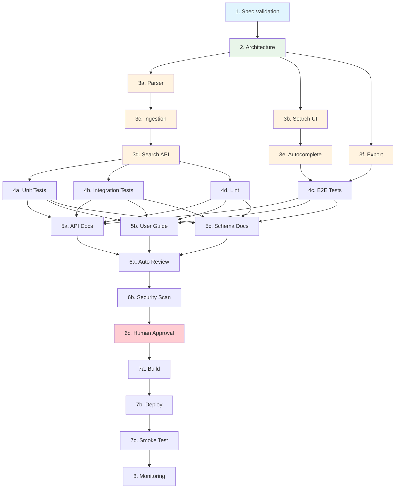

# Agentic SDLC Orchestration Blueprint

> **Framework**: Reusable Agentic SDLC with GitHub Copilot CLI + Extensions
> **Grounding Use Case**: Data Dictionary — OpenAPI specs → PostgreSQL FTS → Search UI on API Portal
> **Stack**: Java 21+ / Spring Boot 3.x
> **Date**: March 2026
> **Status**: Research Complete — Infrastructure Platform Pending Stakeholder Sync

---

## Table of Contents

1. [End-to-End Data Flow Diagram](#1-end-to-end-data-flow-diagram)
2. [Handoff Patterns](#2-handoff-patterns)
3. [Parallel vs Serial Execution Map](#3-parallel-vs-serial-execution-map)
4. [Human-in-the-Loop Checkpoints](#4-human-in-the-loop-checkpoints)
5. [Context Management / State](#5-context-management--state)
6. [Error Handling & Recovery](#6-error-handling--recovery)
7. [Open Items & Stakeholder Dependencies](#7-open-items--stakeholder-dependencies)
8. [Template Parameterization Points](#8-template-parameterization-points)

---

## 1. End-to-End Data Flow Diagram

### 1.1 Pipeline Triggers

The pipeline can be triggered by **three mechanisms**, any of which initiates the same orchestrated flow:

| Trigger | Mechanism | When |
|---------|-----------|------|
| **Git Push** | New/updated OpenAPI spec committed to `specs/` directory | Continuous — every push to `main` or `feature/*` |
| **Manual Dispatch** | `gh aw run` or GitHub Actions `workflow_dispatch` | On-demand — developer or tech lead initiates |
| **Scheduled** | Cron or GitHub Agentic Workflow `schedule: daily around 2am` | Nightly — catch external spec updates |

### 1.2 End-to-End Flow (Mermaid)



### 1.3 Artifacts Produced at Each Phase

| Phase | Inputs | Artifacts Produced | Storage |
|-------|--------|-------------------|---------|
| **1. Spec Ingestion** | Raw OpenAPI YAML/JSON | Validated spec, diff report, spec metadata JSON | `specs/`, `artifacts/spec-metadata.json` |
| **2. Architecture** | Validated spec + prior schema | SQL migrations, ADR doc, schema diagram | `migrations/`, `docs/adr/`, `artifacts/schema.json` |
| **3. Implementation** | Migrations + spec metadata | Parser code, API controllers, frontend components (TBD), DB seed | `src/main/java/parser/`, `src/main/java/api/`, `src/main/resources/templates/`, `src/main/java/export/` |
| **4. QA** | Source code + test fixtures | Test results JSON, coverage report, lint report | `artifacts/test-results.json`, `coverage/` |
| **5. Documentation** | Source code + schema + API | Swagger UI bundle, user guide MD, ERD SVG | `docs/api/`, `docs/guide/`, `docs/schema/` |
| **6. Review** | All above + PR diff | Review comments, security report, approval status | GitHub PR, `artifacts/security-report.json` |
| **7. Deployment** | Docker image + infra code | Deployed URL, deployment log, smoke test results | Container registry, `artifacts/deploy-log.json` |
| **8. Monitoring** | Live application | Telemetry dashboard, error alerts, feedback issues | App Insights, GitHub Issues |

---

## 2. Handoff Patterns

### 2.1 Handoff Architecture

Each phase transition follows a **Declarative Handoff** pattern, inspired by GitHub Copilot's custom agent `handoffs:` frontmatter. Handoffs are:

- **Explicit**: Defined in agent `.md` files as YAML frontmatter
- **Versionable**: Tracked in Git alongside the code
- **Auditable**: Every transition is logged with artifact checksums
- **User-visible**: Presented as button choices in Copilot UI

### 2.2 Handoff Definitions

#### Handoff 1: Trigger → Spec Ingestion

```
┌──────────────┐     ┌──────────────────────┐
│  Git Event / │────▶│  Spec Validator Agent │
│  Manual Run  │     │                      │
└──────────────┘     └──────────────────────┘
```

| Attribute | Value |
|-----------|-------|
| **Handoff Artifact** | Raw OpenAPI spec file(s) + trigger metadata |
| **Handoff Format** | YAML/JSON files on disk (`specs/`) + GitHub event payload |
| **Validation Gate** | File exists, is valid YAML/JSON, has non-zero size |
| **Rollback Strategy** | Reject trigger, create GitHub Issue with parse error details |

#### Handoff 2: Spec Ingestion → Architecture

```
┌──────────────────────┐     ┌────────────────────────┐
│  Spec Validator Agent │────▶│  Schema Architect Agent │
│                      │     │                        │
└──────────────────────┘     └────────────────────────┘
```

| Attribute | Value |
|-----------|-------|
| **Handoff Artifact** | `spec-metadata.json` — Normalized spec with resolved `$ref`, extracted schemas, endpoints, field inventory |
| **Handoff Format** | JSON file following the `SpecMetadata` Java record/POJO |
| **Validation Gate** | (1) OpenAPI 3.x valid, (2) All `$ref` resolved, (3) ≥1 schema with ≥1 property, (4) No circular ref errors |
| **Rollback Strategy** | Write detailed validation errors to `artifacts/validation-errors.json`, create issue, halt pipeline |

**`spec-metadata.json` structure:**

```json
{
  "specId": "petstore-v3.1.0",
  "specVersion": "3.1.0",
  "title": "Petstore API",
  "schemas": [
    {
      "name": "Pet",
      "properties": [
        { "name": "id", "type": "integer", "format": "int64", "description": "Unique ID", "required": true },
        { "name": "name", "type": "string", "description": "Pet name", "required": true, "maxLength": 100 }
      ],
      "usedInEndpoints": ["GET /pets", "POST /pets"]
    }
  ],
  "totalSchemas": 12,
  "totalFields": 87,
  "parsedAt": "2026-03-31T22:00:00Z"
}
```

#### Handoff 3: Architecture → Implementation

```
┌────────────────────────┐     ┌───────────────────┐     ┌──────────────────┐
│  Schema Architect Agent │────▶│  Parser Agent     │────▶│  Ingestion Agent │
│                        │     │  (Backend Track)  │     │                  │
│                        │────▶│  Search UI Agent   │     └──────────────────┘
│                        │     │  (Frontend Track) │
└────────────────────────┘     └───────────────────┘
```

| Attribute | Value |
|-----------|-------|
| **Handoff Artifact** | SQL migration files + `schema-design.json` + ADR document |
| **Handoff Format** | `.sql` migration files (numbered: `001_create_tables.sql`), JSON schema map, Markdown ADR |
| **Validation Gate** | (1) Migrations parse as valid SQL, (2) Schema design covers all spec schemas, (3) ADR reviewed (auto or human), (4) `schema-design.json` matches `spec-metadata.json` field count |
| **Rollback Strategy** | Architect agent re-generates with adjusted constraints; if 2nd attempt fails, escalate to human |

**`schema-design.json` structure:**

```json
{
  "tables": [
    {
      "name": "api_specs",
      "columns": ["id", "title", "version", "source_file", "parsed_at"],
      "purpose": "Registry of ingested OpenAPI specifications"
    },
    {
      "name": "fields",
      "columns": ["id", "schema_id", "name", "type", "description", "constraints", "search_vector"],
      "indexes": ["GIN on search_vector", "GIN trgm on name"],
      "purpose": "Individual schema properties with FTS support"
    }
  ],
  "migrationFiles": ["001_create_tables.sql", "002_create_indexes.sql", "003_seed_tsvector.sql"]
}
```

#### Handoff 4: Implementation → QA

```
┌───────────────────┐     ┌──────────────────┐
│  Search API Agent │────▶│  Unit Test Agent  │
│  Export Agent     │────▶│  Integration Test │
│  (all impl done)  │────▶│  E2E Test Agent   │
└───────────────────┘     └──────────────────┘
```

| Attribute | Value |
|-----------|-------|
| **Handoff Artifact** | Complete source code in `src/`, `pom.xml` with deps, Docker Compose for test DB |
| **Handoff Format** | Java source files + `docker-compose.test.yml` + test fixture JSON |
| **Validation Gate** | (1) `mvn package` succeeds (Java compiles), (2) All source files lint-clean, (3) Docker Compose valid |
| **Rollback Strategy** | If build fails → Implementation agents re-run with compile errors as context. Max 2 retries before human escalation |

#### Handoff 5: QA → Documentation

```
┌──────────────────┐     ┌──────────────────┐
│  Test Agents     │────▶│  API Docs Agent   │
│  (all pass)      │────▶│  User Guide Agent │
│                  │────▶│  Schema Docs Agent│
└──────────────────┘     └──────────────────┘
```

| Attribute | Value |
|-----------|-------|
| **Handoff Artifact** | `test-results.json` with pass/fail counts, coverage report, lint report |
| **Handoff Format** | JSON test results, JaCoCo coverage report, Checkstyle/SpotBugs report |
| **Validation Gate** | (1) All tests pass, (2) Coverage ≥ 80% for parser/API modules, (3) No Checkstyle/SpotBugs errors (warnings OK) |
| **Rollback Strategy** | Failing tests → route back to Implementation agents with test failure context. Coverage gap → generate additional tests first |

#### Handoff 6: Documentation → Review

```
┌──────────────────┐     ┌──────────────────┐
│  Docs Agents     │────▶│  Code Review Agent│
│  (docs generated)│────▶│  Security Scan    │
│                  │────▶│  Human Reviewer   │
└──────────────────┘     └──────────────────┘
```

| Attribute | Value |
|-----------|-------|
| **Handoff Artifact** | Complete PR with all source, tests, docs, migrations |
| **Handoff Format** | GitHub Pull Request + PR description summary + artifact links |
| **Validation Gate** | (1) Docs generated for all public APIs, (2) No TODO/FIXME in production code, (3) All artifact checksums match |
| **Rollback Strategy** | Review issues → create sub-issues tagged by phase, route back to appropriate agent |

#### Handoff 7: Review → Deployment

```
┌──────────────────┐     ┌──────────────────┐
│  Human Approves  │────▶│  Build Agent     │
│  PR Merged       │────▶│  Deploy Agent    │
│                  │     │  Smoke Test Agent│
└──────────────────┘     └──────────────────┘
```

| Attribute | Value |
|-----------|-------|
| **Handoff Artifact** | Merged PR SHA + approval record + security scan clean report |
| **Handoff Format** | Git merge commit + GitHub deployment event + `artifacts/security-report.json` |
| **Validation Gate** | (1) PR approved by ≥1 human, (2) All CI checks green, (3) Security scan clean, (4) No merge conflicts |
| **Rollback Strategy** | Deployment failure → revert to last known good deployment, create incident issue, notify team |

### 2.3 Handoff File Convention

All agent-to-agent handoffs use **handover files** stored in `artifacts/handovers/`:

```
artifacts/
  handovers/
    01-spec-to-architect.json       # Spec Ingestion → Architecture
    02-architect-to-impl.json       # Architecture → Implementation
    03-impl-to-qa.json              # Implementation → QA
    04-qa-to-docs.json              # QA → Documentation
    05-docs-to-review.json          # Documentation → Review
    06-review-to-deploy.json        # Review → Deployment
```

**Standard handover file schema:**

```java
// HandoverFile.java
public record HandoverFile(
    String fromAgent,           // e.g., "spec-validator"
    String toAgent,             // e.g., "schema-architect"
    int phase,                  // 1-8
    String timestamp,           // ISO 8601
    String status,              // "success" | "partial" | "failed"
    List<Artifact> artifacts,
    Context context,
    RollbackInfo rollbackInfo
) {
    public record Artifact(
        String path,            // Relative path to artifact
        String checksum,        // SHA-256 hash
        String description
    ) {}

    public record Context(
        String summary,                 // Natural language summary (< 500 words)
        List<String> keyDecisions,      // Decisions made in this phase
        List<String> warnings,          // Issues the next agent should know about
        Map<String, Number> metrics     // Quantitative results
    ) {}

    public record RollbackInfo(
        String lastGoodState,    // Git SHA or checkpoint ID
        String rollbackCommand   // Command to execute rollback
    ) {}
}
```

---

## 3. Parallel vs Serial Execution Map

### 3.1 Dependency Graph (Critical Path)



**The critical path is always serial** — you cannot implement before architecture, test before implementation, or deploy before review. Total serial phases: **6 sequential gates**.

### 3.2 Parallelism Within Phases

```
Phase 1: Spec Ingestion
├── [PARALLEL] Spec validation + Spec diff detection
└── [SERIAL]   Write spec-metadata.json (requires both above)

Phase 2: Architecture
├── [SERIAL]   Schema design (depends on validated spec)
├── [PARALLEL] Migration generation + ADR authoring (from schema design)
└── [SERIAL]   Merge & validate (requires both above)

Phase 3: Implementation  ★ HIGHEST PARALLELISM ★
├── [PARALLEL TRACK A - Backend]
│   ├── Parser module (OpenAPI → parsed JSON)
│   ├── Ingestion module (parsed JSON → PostgreSQL)  [depends on parser]
│   └── Search API endpoints (FTS + trgm queries)    [depends on ingestion]
├── [PARALLEL TRACK B - Frontend]
│   ├── Search UI component (TBD — React, Thymeleaf, or separate SPA)
│   ├── Search UI component                        [depends on search UI]
│   └── Export component (CSV/Excel via Apache POI) [independent]
└── [SYNC POINT] Both tracks complete before QA

Phase 4: QA  ★ HIGH PARALLELISM ★
├── [PARALLEL] Unit tests (JUnit 5 + Mockito, no DB needed)
├── [PARALLEL] Integration tests (Testcontainers + Spring Boot Test)
├── [PARALLEL] E2E tests (Selenium / Playwright for Java)
├── [PARALLEL] Checkstyle + SpotBugs check
└── [SYNC POINT] All 4 must pass

Phase 5: Documentation  ★ FULLY PARALLEL ★
├── [PARALLEL] API documentation (Swagger/Redoc)
├── [PARALLEL] User guide (search UI usage)
├── [PARALLEL] Schema documentation (ERD + dictionary)
└── [SYNC POINT] All docs generated

Phase 6: Review
├── [PARALLEL] Copilot Code Review + Security scan
├── [SERIAL]   Human review (after automated checks)
└── [SERIAL]   Approval decision

Phase 7: Deployment
├── [SERIAL]   Build → Deploy → Smoke test
└── (No parallelism — sequential safety)

Phase 8: Monitoring
├── [PARALLEL] Telemetry setup + alert configuration
└── [CONTINUOUS] Ongoing observation
```

### 3.3 Critical Path Timing Estimate

```
┌──────────────────────────┬──────────┬───────────┐
│ Phase                    │ Duration │ Parallel? │
├──────────────────────────┼──────────┼───────────┤
│ 1. Spec Ingestion        │ ~2 min   │ Internal  │
│ 2. Architecture          │ ~5 min   │ Internal  │
│ 3. Implementation        │ ~15 min  │ 2 tracks  │
│ 4. QA                    │ ~8 min   │ 4-way     │
│ 5. Documentation         │ ~5 min   │ 3-way     │
│ 6. Review (automated)    │ ~5 min   │ Internal  │
│ 6. Review (human)        │ VARIABLE │ Blocked   │
│ 7. Deployment            │ ~10 min  │ None      │
│ 8. Monitoring setup      │ ~3 min   │ Internal  │
├──────────────────────────┼──────────┼───────────┤
│ TOTAL (automated only)   │ ~53 min  │           │
│ TOTAL (with human review)│ ~53 min + human wait  │
└──────────────────────────┴──────────┴───────────┘
```

> **Note**: The 59-minute timeout for cloud-based Copilot coding agents means the automated portion fits within a single session. With the `runSubagent` approach locally, there is no timeout.

### 3.4 Dependency Graph (Mermaid)



---

## 4. Human-in-the-Loop Checkpoints

### 4.1 Checkpoint Map

```
Phase Flow:
  [AUTO] Spec Validation ──────────────────────────────────────► OK
         │
         ▼ CHECKPOINT 1 (Optional)
  [HUMAN] Review spec diff if breaking changes detected
         │
         ▼
  [AUTO] Architecture + Schema Design ─────────────────────────► OK
         │
         ▼ CHECKPOINT 2 (Recommended)
  [HUMAN] Review ADR for new table/index decisions
         │
         ▼
  [AUTO] Implementation (Backend + Frontend) ──────────────────► OK
  [AUTO] QA (Unit + Integration + E2E + Lint) ─────────────────► OK
  [AUTO] Documentation Generation ─────────────────────────────► OK
         │
         ▼ CHECKPOINT 3 (MANDATORY)
  [HUMAN] PR Review — Full code review + approval
         │
         ▼
  [AUTO] Build + Deploy to Staging ────────────────────────────► OK
         │
         ▼ CHECKPOINT 4 (Recommended for Production)
  [HUMAN] Production deployment approval (environment protection rule)
         │
         ▼
  [AUTO] Smoke Test + Monitoring ──────────────────────────────► OK
```

### 4.2 Checkpoint Details

#### Checkpoint 1: Breaking Change Review (Optional)

| Attribute | Detail |
|-----------|--------|
| **When** | Spec diff agent detects breaking changes (removed fields, type changes, removed endpoints) |
| **What to Present** | Side-by-side spec diff, list of breaking fields, affected downstream consumers |
| **Approval Workflow** | GitHub Issue auto-created with `breaking-change` label; tech lead comments `/approve` or `/reject` |
| **If Approved** | Pipeline continues with migration that includes backward-compatible handling |
| **If Rejected** | Pipeline halts; spec author notified to revise |
| **If Modified** | Issue updated with revised spec path; pipeline re-triggers on spec update |

#### Checkpoint 2: Architecture Decision Review (Recommended)

| Attribute | Detail |
|-----------|--------|
| **When** | New tables, new indexes, schema redesign, or first-time run |
| **What to Present** | ADR document, proposed schema ERD, migration SQL preview, performance impact estimate |
| **Approval Workflow** | PR comment thread on the ADR file; `/approve-architecture` command |
| **If Approved** | Implementation agents proceed |
| **If Rejected** | Architecture agent re-runs with reviewer feedback as additional context |
| **Skip Condition** | Minor field additions (< 5 new fields, no new tables) auto-approve |

#### Checkpoint 3: PR Code Review (MANDATORY)

| Attribute | Detail |
|-----------|--------|
| **When** | Always — after all automated checks pass |
| **What to Present** | Full PR with: (1) Copilot auto-review summary, (2) Security scan results, (3) Test coverage delta, (4) Generated documentation preview, (5) Migration dry-run output |
| **Approval Workflow** | Standard GitHub PR review — at least 1 approval from `CODEOWNERS` |
| **If Approved** | PR merged → deployment pipeline triggered |
| **If Changes Requested** | Issues tagged by phase; relevant agents re-run with review comments as context |
| **If Rejected** | Pipeline cancelled; post-mortem issue created |

#### Checkpoint 4: Production Deployment Gate (Recommended)

| Attribute | Detail |
|-----------|--------|
| **When** | Deploying to production environment (vs staging/preview) |
| **What to Present** | Staging smoke test results, performance comparison, rollback plan |
| **Approval Workflow** | GitHub Environment protection rule with required reviewers |
| **If Approved** | Production deployment proceeds |
| **If Rejected** | Stays on staging; feedback routed to appropriate phase |

### 4.3 Approval Patterns Comparison

| Pattern | Pros | Cons | Use When |
|---------|------|------|----------|
| **PR-based** | Familiar, auditable, supports threaded discussion | Slower for minor changes | Checkpoint 3 (always), Checkpoint 4 |
| **Issue-based** | Good for async decisions, supports labels/milestones | Less connected to code | Checkpoint 1 (breaking changes) |
| **Slash-command** | Fast, stays in context | Less discoverable | Checkpoint 2 (architecture quick-approve) |
| **Environment gates** | Built into GitHub, enforced by platform | Requires GitHub Enterprise for some features | Checkpoint 4 (production) |

**Recommended**: PR-based for the mandatory gate (Checkpoint 3). Issue-based for breaking changes. Environment gates for production.

---

## 5. Context Management / State

### 5.1 State Architecture

```
┌─────────────────────────────────────────────────────────────────┐
│                    STATE MANAGEMENT LAYERS                       │
├─────────────────────────────────────────────────────────────────┤
│                                                                 │
│  Layer 1: GIT (Persistent, Versioned)                          │
│  ┌───────────────────────────────────────────────────────────┐ │
│  │  specs/          → OpenAPI source files                    │ │
│  │  migrations/     → SQL migration files                     │ │
│  │  src/            → Generated + modified source code (Java)     │ │
│  │  docs/           → Generated documentation                 │ │
│  │  .github/agents/ → Agent definitions (framework constant)  │ │
│  │  .github/copilot-instructions.md → Project context         │ │
│  └───────────────────────────────────────────────────────────┘ │
│                                                                 │
│  Layer 2: ARTIFACTS (Ephemeral, Per-Run)                       │
│  ┌───────────────────────────────────────────────────────────┐ │
│  │  artifacts/handovers/   → Handoff files between agents     │ │
│  │  artifacts/test-results.json  → QA output                  │ │
│  │  artifacts/security-report.json → Security scan            │ │
│  │  artifacts/spec-metadata.json   → Parsed spec data         │ │
│  │  artifacts/schema-design.json   → Schema architecture      │ │
│  └───────────────────────────────────────────────────────────┘ │
│                                                                 │
│  Layer 3: DATABASE (Persistent, Queryable)                     │
│  ┌───────────────────────────────────────────────────────────┐ │
│  │  PostgreSQL                                                │ │
│  │  ├── pipeline_runs      → Run metadata, status, timing    │ │
│  │  ├── agent_executions   → Per-agent logs, inputs, outputs  │ │
│  │  └── data dictionary tables (api_specs, schemas, fields)   │ │
│  └───────────────────────────────────────────────────────────┘ │
│                                                                 │
│  Layer 4: ENVIRONMENT (Session-scoped)                         │
│  ┌───────────────────────────────────────────────────────────┐ │
│  │  .env                → DB connection, API keys              │ │
│  │  application.yml    → Spring Boot configuration             │ │
│  │  GitHub Secrets      → Production credentials               │ │
│  │  MCP Server context  → Live tool connections                │ │
│  └───────────────────────────────────────────────────────────┘ │
│                                                                 │
└─────────────────────────────────────────────────────────────────┘
```

### 5.2 How Agents Share State

| Mechanism | What It Carries | Agent Scope | Persistence |
|-----------|----------------|-------------|-------------|
| **Handover files** (`artifacts/handovers/`) | Distilled context, artifact refs, decisions, warnings | Between consecutive agents | Per pipeline run |
| **Git working tree** | Source code, migrations, docs | All agents in a run | Permanent (committed) |
| **MCP Server resources** | Live DB state, GitHub issue/PR data, file system | Within a single agent session | Session-scoped |
| **Custom instructions** (`.github/copilot-instructions.md`) | Project context, coding standards, conventions | All agents, all runs | Permanent |
| **Agent definition files** (`.github/agents/*.agent.md`) | Agent-specific persona, tools, handoffs | Per agent type | Permanent |
| **Environment variables** (`.env`, GitHub Secrets) | Connection strings, API keys | All agents | Permanent |

### 5.3 Context Window Management

**Problem**: LLM context windows are finite (8K–200K tokens). A large OpenAPI spec + full codebase can easily exceed limits.

**Strategies**:

1. **Distilled Handovers** — Each handover file contains a `context.summary` (< 500 words) instead of raw artifacts. The summary captures key decisions and warnings, not raw data.

2. **Chunked Processing** — The parser agent processes one schema at a time, writing results incrementally to `spec-metadata.json`. The agent never loads the entire spec into context.

3. **MCP Resource References** — Instead of pasting file contents into prompts, agents reference files via MCP server `file://` resource URIs. The MCP server streams only the needed portion.

4. **Instruction Layering** — Use `.github/instructions/*.instructions.md` files scoped by path pattern:
   ```
   .github/instructions/
     frontend.instructions.md              → applyTo: "src/main/resources/templates/**"
     database.instructions.md              → applyTo: "src/main/java/**/repository/**,migrations/**"
     api-parsing.instructions.md           → applyTo: "src/main/java/**/parser/**"
   ```
   Each agent only receives instructions relevant to its working directory.

5. **Progressive Summarization** — Long-running pipelines use a `pipeline-state.md` file that each agent appends to with a 2-3 sentence summary of its work. This provides a running log without growing unboundedly.

### 5.4 Session State vs Persistent State

| Type | Examples | Lifecycle | Storage |
|------|----------|-----------|---------|
| **Session state** | Current agent's working memory, MCP tool connections, open file handles | Single agent execution | In-memory + MCP |
| **Run state** | Pipeline run ID, phase completion flags, handover files, test results | Single pipeline run | `artifacts/` directory |
| **Project state** | Source code, migrations, docs, custom instructions, agent definitions | Across all runs | Git repository |
| **Infrastructure state** | Database contents, deployed application, monitoring config | Across deployments | PostgreSQL, cloud platform |

### 5.5 MCP Server Configuration for State Access

```json
// .vscode/mcp.json
{
  "servers": {
    "postgres": {
      "command": "npx",
      "args": ["-y", "@modelcontextprotocol/server-postgres", "${DATABASE_URL}"],
      "type": "stdio"
    },
    "filesystem": {
      "command": "npx",
      "args": ["-y", "@modelcontextprotocol/server-filesystem", "./src", "./artifacts", "./specs"],
      "type": "stdio"
    },
    "github": {
      "command": "npx",
      "args": ["-y", "@modelcontextprotocol/server-github"],
      "type": "stdio",
      "env": { "GITHUB_TOKEN": "${GITHUB_TOKEN}" }
    }
  }
}
```

> **Note**: MCP server configuration uses `npx` for the MCP server processes themselves — this is independent of the application tech stack. The application is built with Java/Spring Boot.

---

## 6. Error Handling & Recovery

### 6.1 Error Classification

```
┌───────────────────────────────────────────────────────────┐
│                   ERROR SEVERITY LEVELS                    │
├─────────┬─────────────────────────┬───────────────────────┤
│ Level   │ Examples                │ Response              │
├─────────┼─────────────────────────┼───────────────────────┤
│ FATAL   │ Invalid spec (no schemas│ Halt pipeline,        │
│         │  found), DB unreachable,│ create issue,         │
│         │  auth failure           │ notify team           │
├─────────┼─────────────────────────┼───────────────────────┤
│ ERROR   │ Test failures, lint     │ Retry with context,   │
│         │  errors, build failure, │ max 2 retries,        │
│         │  agent timeout          │ then escalate         │
├─────────┼─────────────────────────┼───────────────────────┤
│ WARNING │ Low coverage, missing   │ Log warning,          │
│         │  descriptions in spec,  │ continue pipeline,    │
│         │  deprecated API usage   │ flag in PR review     │
├─────────┼─────────────────────────┼───────────────────────┤
│ INFO    │ Spec has no changes,    │ Skip phase,           │
│         │  all tests already pass │ log and continue      │
└─────────┴─────────────────────────┴───────────────────────┘
```

### 6.2 Retry Strategy

```java
// RetryPolicy.java
public record RetryPolicy(
    int maxRetries,            // Default: 2
    long backoffMs,            // Default: 5000 (5s)
    double backoffMultiplier,  // Default: 2 (exponential)
    List<String> retryableErrors,  // Error codes that trigger retry
    boolean contextAdjustment  // Rephrase/adjust prompt on retry
) {}

// Phase-specific retry policies
public static final Map<String, RetryPolicy> RETRY_POLICIES = Map.of(
    "spec-validation",   new RetryPolicy(1, 2000, 1, List.of("PARSE_ERROR"), false),
    "architecture",      new RetryPolicy(2, 5000, 2, List.of("GENERATION_ERROR"), true),
    "implementation",    new RetryPolicy(2, 5000, 2, List.of("COMPILE_ERROR", "TYPE_ERROR"), true),
    "testing",           new RetryPolicy(2, 3000, 2, List.of("TEST_FAILURE", "TIMEOUT"), true),
    "documentation",     new RetryPolicy(1, 2000, 1, List.of("GENERATION_ERROR"), false),
    "deployment",        new RetryPolicy(1, 10000, 2, List.of("DEPLOY_TIMEOUT"), false)
);
```

### 6.3 Failure Recovery Flows

```
Agent Fails
    │
    ▼
Is error retryable?
    │
    ├── YES ──► Retry with context adjustment
    │           (include error message in next prompt)
    │               │
    │               ▼
    │           Retry succeeded?
    │               │
    │               ├── YES ──► Continue pipeline
    │               │
    │               └── NO ──► Max retries exceeded?
    │                              │
    │                              ├── YES ──► Escalate to human
    │                              │           (create GitHub Issue)
    │                              │
    │                              └── NO ──► Retry again
    │
    └── NO ──► Is phase optional?
                   │
                   ├── YES ──► Skip phase, log warning,
                   │           continue with degraded output
                   │
                   └── NO ──► Halt pipeline
                              Create incident issue
                              Preserve partial artifacts
                              Notify team (Slack/email/issue)
```

### 6.4 Graceful Degradation Rules

| Phase | Optional? | Degraded Behavior |
|-------|-----------|-------------------|
| Spec Validation | **NO** | Cannot proceed without valid spec |
| Architecture | **NO** | Cannot implement without schema design |
| Parser (Backend) | **NO** | Core functionality |
| Search API | **NO** | Core functionality |
| Search UI | **NO** | Core functionality |
| Autocomplete | **YES** | UI works without autocomplete; basic search still functions |
| CSV/Excel Export | **YES** | Users can still search, just can't export |
| Unit Tests | **NO** | Quality gate — must pass |
| Integration Tests | Soft NO | Can proceed if unit tests pass + human acknowledges risk |
| E2E Tests | **YES** | Can deploy without E2E if unit + integration pass |
| Documentation | **YES** | Can deploy without docs; flag for follow-up |
| Copilot Code Review | **YES** | Human review is the hard gate, not AI review |
| Security Scan | Soft NO | Can proceed with human sign-off on risk |
| Human Review | **NO** | Mandatory gate |
| Deployment | **NO** | Core purpose |
| Smoke Tests | **YES** | Can skip if deployment succeeded + monitoring is active |

### 6.5 Alerting & Notification

```yaml
# Notification matrix
notifications:
  fatal_error:
    channels: [github-issue, slack, email]
    audience: [tech-lead, on-call]
    urgency: immediate
    template: "🔴 Pipeline FATAL: {error_message} in phase {phase}"

  retry_exhausted:
    channels: [github-issue, slack]
    audience: [tech-lead]
    urgency: high
    template: "🟠 Pipeline blocked: {phase} failed after {retries} retries"

  degraded_pipeline:
    channels: [github-issue]
    audience: [team]
    urgency: normal
    template: "🟡 Pipeline completed with degraded output: {skipped_phases}"

  success:
    channels: [slack]
    audience: [team]
    urgency: low
    template: "🟢 Pipeline complete: {spec_name} → {deployment_url}"
```

---

## 7. Open Items & Stakeholder Dependencies

### 7.1 Infrastructure Uncertainty Map

```
┌─────────────────────────────────────────────────────────────────┐
│              DECISION DEPENDENCY MAP                             │
├─────────────────────────────────────────────────────────────────┤
│                                                                 │
│  ✅ CAN PROCEED INDEPENDENTLY (No blockers)                    │
│  ┌───────────────────────────────────────────────────────────┐ │
│  │  • OpenAPI spec parsing pipeline (all phases 1-3 backend) │ │
│  │  • PostgreSQL schema design + migrations                   │ │
│  │  • Full-text search + trgm implementation                  │ │
│  │  • Unit + integration tests (Docker local PG)              │ │
│  │  • Agent definitions + orchestration framework             │ │
│  │  • Handoff patterns + context management                   │ │
│  │  • Documentation generation pipeline                       │ │
│  │  • CI/CD pipeline (GitHub Actions)                         │ │
│  └───────────────────────────────────────────────────────────┘ │
│                                                                 │
│  ⚠️ PARTIALLY BLOCKED (Can scaffold, cannot finalize)         │
│  ┌───────────────────────────────────────────────────────────┐ │
│  │  • Frontend search UI component                            │ │
│  │    └── Blocked by: Which UI framework does the portal use? │ │
│  │        (React? Thymeleaf? JSP? Separate SPA?)              │ │
│  │    └── Mitigation: Build as standalone component            │ │
│  │        with adapter pattern for any UI library              │ │
│  │                                                             │ │
│  │  • Export feature (CSV/Excel)                               │ │
│  │    └── Blocked by: Portal's existing export patterns?       │ │
│  │    └── Mitigation: Build as standalone endpoint +           │ │
│  │        downloadable component                               │ │
│  └───────────────────────────────────────────────────────────┘ │
│                                                                 │
│  🔴 BLOCKED (Cannot proceed without decision)                  │
│  ┌───────────────────────────────────────────────────────────┐ │
│  │  • Deployment target                                       │ │
│  │    └── Blocked by: Where is the API Portal hosted?         │ │
│  │        (Azure App Service? AWS? Kubernetes? On-prem?)       │ │
│  │    └── Impact: Deployment agent, Dockerfile, infra code     │ │
│  │                                                             │ │
│  │  • Database hosting                                        │ │
│  │    └── Blocked by: Managed PostgreSQL instance?             │ │
│  │        (Azure Flexible Server? AWS RDS? Self-hosted?)       │ │
│  │    └── Impact: Connection config, SSL, pg_trgm availability│ │
│  │                                                             │ │
│  │  • Authentication / Authorization                           │ │
│  │    └── Blocked by: Portal's auth mechanism?                │ │
│  │        (Entra ID? OAuth? API keys? None?)                   │ │
│  │    └── Impact: API middleware, frontend auth flow            │ │
│  │                                                             │ │
│  │  • Network access                                           │ │
│  │    └── Blocked by: VPN? Private endpoints? Public?          │ │
│  │    └── Impact: CI/CD connectivity, developer access         │ │
│  └───────────────────────────────────────────────────────────┘ │
│                                                                 │
└─────────────────────────────────────────────────────────────────┘
```

### 7.2 Stakeholder Sync Agenda

**Meeting Title**: Data Dictionary Infrastructure & Integration Decisions
**Duration**: 60 minutes
**Attendees**: Tech Lead, Platform Team, API Portal Owner, DBA, Security

```
AGENDA:

1. API Portal Platform (15 min)
   □ What platform hosts the API Portal today?
   □ What frontend framework/version is in use?
   □ How are new features integrated? (monorepo? micro-frontend? Maven module?)
   □ What is the deployment pipeline for the portal?
   □ Can we deploy a standalone service, or must we integrate into existing codebase?

2. Database Decision (10 min)
   □ Managed PostgreSQL available? (Azure Flexible Server / AWS RDS / other?)
   □ PostgreSQL version? (15+ needed for optimal FTS)
   □ Can we install extensions? (pg_trgm, uuid-ossp)
   □ Connection method? (Direct? Connection pooler? Private endpoint?)
   □ Existing DBA support for schema reviews?

3. Authentication & Security (10 min)
   □ How does the portal authenticate users today?
   □ Does the data dictionary need auth, or is it public within the org?
   □ Are there data classification concerns with exposing API schema metadata?
   □ Security review process for new features?

4. Network & Access (10 min)
   □ Is the portal on a private network? VPN required?
   □ Can GitHub Actions runners reach the database? (self-hosted runners?)
   □ CI/CD: GitHub Actions or another platform?

5. Integration Pattern Decision (10 min)
   □ OPTION A: Standalone microservice (own Spring Boot app, own DB, API consumed by portal)
   □ OPTION B: Embedded feature (integrated into portal codebase)
   □ OPTION C: Hybrid (standalone API + portal widget/iframe)
   □ Decision impacts: deployment, testing, ownership, maintenance

6. Next Steps & Timeline (5 min)
   □ Agree on Option A/B/C
   □ Assign: DB provisioning, auth integration, VPN access
   □ Timeline for unblocking deployment phase
```

### 7.3 What Can Proceed Now (Pre-Sync)

The framework is designed so that **~80% of the work is infrastructure-independent**:

```
INDEPENDENT (Build Now)                 DEPENDENT (Build After Sync)
─────────────────────────               ──────────────────────────
✅ OpenAPI parser                       🔴 Deployment config (Dockerfile, infra)
✅ PostgreSQL schema + migrations       🔴 Auth middleware (Spring Security)
✅ FTS + trgm search engine             🔴 Network/VPN setup
✅ API endpoints (Spring Boot / Spring Web)  ⚠️ Frontend UI (build generic, adapt later)
✅ Unit + integration tests             ⚠️ Export format (match portal conventions)
✅ Agent definitions + orchestration
✅ CI pipeline (lint, test, build)
✅ Documentation pipeline
✅ Handoff framework
```

---

## 8. Template Parameterization Points

### 8.1 Framework Constants vs Project Variables

The orchestration framework has clear **swap points** where project-specific values are injected:

```
FRAMEWORK (Constant)                    PROJECT-SPECIFIC (Parameterized)
════════════════════                    ════════════════════════════════
Pipeline phases (1-8)                   OpenAPI spec file paths
Agent definitions (roles + handoffs)    Database connection string
Handover file schema                    Table/column naming conventions
Retry policies                          UI framework choice
Error classification                    Deployment target
Checkpoint gates                        Auth mechanism
Context management patterns             Search ranking weights
Notification templates                  Team notification channels
```

### 8.2 Configuration File: `pipeline.config.yaml`

This is the single file that makes the framework project-specific:

```yaml
# pipeline.config.yaml — The ONLY file you change per project

project:
  name: "data-dictionary"
  description: "Searchable data dictionary from OpenAPI specs"
  repository: "org/data-dictionary"

# ── SWAP POINT 1: Input Specifications ──
specs:
  source_directory: "specs/"
  format: "openapi"           # openapi | graphql | protobuf (future)
  versions: ["3.0", "3.1"]
  glob_pattern: "**/*.{yaml,yml,json}"

# ── SWAP POINT 2: Database ──
database:
  type: "postgresql"          # postgresql | sqlite (for local dev)
  version: "15+"
  extensions: ["pg_trgm", "uuid-ossp"]
  connection_env: "DATABASE_URL"
  schema_prefix: "datadict_"
  tables:
    specs: "api_specs"
    schemas: "schemas"
    fields: "fields"
    field_usage: "field_usage"

# ── SWAP POINT 3: Search Configuration ──
search:
  engine: "postgresql-fts"    # postgresql-fts | elasticsearch (future)
  fts_config: "english"       # PostgreSQL text search configuration
  trigram_threshold: 0.3      # pg_trgm similarity threshold
  debounce_ms: 300
  max_results: 50
  highlight: true

# ── SWAP POINT 4: Frontend ──
frontend:
  framework: "tbd"            # thymeleaf | react | vue | angular | none
  version: "tbd"
  ui_library: "tbd"           # bootstrap | mui | tailwind | none
  integration_mode: "standalone"  # standalone | embedded | widget

# ── SWAP POINT 5: Export ──
export:
  formats: ["csv", "xlsx"]
  csv_library: "opencsv"      # OpenCSV for CSV generation
  xlsx_library: "apache-poi"  # Apache POI for Excel generation
  max_rows: 10000
  include_metadata: true

# ── SWAP POINT 6: Deployment ──
deployment:
  target: "tbd"               # azure-container-apps | azure-app-service | aws-ecs | k8s | docker-compose
  registry: "tbd"             # ghcr.io/org | acr.azurecr.io | ecr
  environments:
    staging: { auto_deploy: true }
    production: { requires_approval: true }

# ── SWAP POINT 7: Authentication ──
auth:
  mechanism: "tbd"            # entra-id | oauth2 | api-key | none
  required_for: ["write"]     # read | write | admin
  public_read: true           # Can unauthenticated users search?

# ── SWAP POINT 8: Notifications ──
notifications:
  slack_webhook_env: "SLACK_WEBHOOK_URL"
  github_issues: true
  email: false

# ── SWAP POINT 9: Quality Gates ──
quality:
  min_test_coverage: 80
  require_lint_clean: true
  require_security_scan: true
  max_retries: 2
  human_review_required: true

# ── SWAP POINT 10: Agent Configuration ──
agents:
  engine: "copilot"           # copilot | claude | gpt-4o
  isolation: "subagent"       # subagent | worktree | workspace
  timeout_minutes: 55         # Stay under 59-min cloud limit
  max_premium_requests: 50
```

### 8.3 Parameterization Architecture

```
┌─────────────────────────────────────────────────────────┐
│                  REUSABLE FRAMEWORK                      │
│                                                         │
│  .github/                                               │
│  ├── agents/                                            │
│  │   ├── spec-validator.agent.md      ← Framework       │
│  │   ├── schema-architect.agent.md    ← Framework       │
│  │   ├── parser.agent.md              ← Framework       │
│  │   ├── search-api.agent.md          ← Framework       │
│  │   ├── search-ui.agent.md           ← Framework       │
│  │   ├── test-runner.agent.md         ← Framework       │
│  │   ├── doc-generator.agent.md       ← Framework       │
│  │   ├── code-reviewer.agent.md       ← Framework       │
│  │   └── deployer.agent.md            ← Framework       │
│  ├── copilot-instructions.md          ← PROJECT-SPECIFIC│
│  ├── instructions/                                      │
│  │   ├── react-components.instructions.md  ← PROJECT    │
│  │   │   (or frontend.instructions.md for Thymeleaf)   │
│  │   ├── database.instructions.md          ← PROJECT    │
│  │   └── api-parsing.instructions.md       ← PROJECT    │
│  └── workflows/                                         │
│      └── sdlc-pipeline.yml            ← Framework       │
│                                                         │
│  pom.xml (or build.gradle)            ← PROJECT-SPECIFIC│
│                                                         │
│  pipeline.config.yaml                 ← PROJECT-SPECIFIC│
│  src/                                ← PROJECT-SPECIFIC│
│  │   └── main/java/**/*.java         (Java source)     │
│  │   └── main/resources/             (Config, templates)│
│  │   └── test/java/**/*.java         (Test source)     │
│  specs/                               ← PROJECT-SPECIFIC│
│  │   └── *.yaml                       (Input specs)     │
│                                                         │
│  templates/                           ← Framework       │
│  ├── handover-schema.json                               │
│  ├── spec-metadata-schema.json                          │
│  ├── schema-design-schema.json                          │
│  └── test-results-schema.json                           │
│                                                         │
└─────────────────────────────────────────────────────────┘
```

### 8.4 How to Instantiate for a New Project

```bash
# Step 1: Clone the framework
gh repo create my-org/new-data-dict --template agentic-sdlc-framework

# Step 2: Configure
cp pipeline.config.example.yaml pipeline.config.yaml
# Edit: project name, DB connection, UI framework, deployment target

# Step 3: Add your specs
cp /path/to/my-openapi-specs/*.yaml specs/

# Step 4: Update project-specific instructions
# Edit .github/copilot-instructions.md with domain context

# Step 5: Run the pipeline
gh aw run sdlc-pipeline
# OR
git add specs/ && git commit -m "feat: add API specs" && git push
```

### 8.5 Extensibility Points

| Extension | How to Add | Example |
|-----------|-----------|---------|
| **New spec format** | Add parser agent variant in `.github/agents/` | GraphQL schema parser |
| **New search engine** | Swap `search.engine` in config, add corresponding API agent | Elasticsearch instead of PG FTS |
| **New UI framework** | Swap `frontend.framework`, update UI agent instructions | Thymeleaf or React SPA instead of default |
| **New deployment target** | Swap `deployment.target`, add deploy agent variant | Kubernetes instead of Azure |
| **New export format** | Add format to `export.formats`, extend export agent | PDF export |
| **New quality gate** | Add to `quality` config, add gate agent | Performance benchmark gate |
| **Custom MCP server** | Add to `.vscode/mcp.json`, reference in agent definitions | Jira MCP for ticket tracking |

---

## Appendix A: Agent Definition Template

Each agent in `.github/agents/` follows this structure:

```markdown
---
name: spec-validator
description: Validates OpenAPI specifications for structure and completeness
tools:
  - filesystem
  - bash
handoffs:
  - agent: schema-architect
    prompt: "Design the PostgreSQL schema based on the validated spec at {spec_path}"
    label: "Design Schema"
  - agent: REJECT
    prompt: "Create issue: spec validation failed with errors: {errors}"
    label: "Reject Spec"
---

# Spec Validator Agent

## Role
You validate OpenAPI specifications for structural correctness and completeness.

## Instructions
1. Read the OpenAPI spec from the path provided
2. Validate against OpenAPI 3.x schema
3. Check that all $ref pointers resolve
4. Verify at least one schema with properties exists
5. Extract metadata and write to artifacts/spec-metadata.json
6. Write handover file to artifacts/handovers/01-spec-to-architect.json

## Quality Criteria
- All $ref resolved (no dangling references)
- At least 1 schema with at least 1 property
- Descriptions present on > 50% of fields (warn if not)
- No circular references that would cause infinite loops

## Output
Write the handover file and present the handoff buttons.
```

---

## Appendix B: GitHub Agentic Workflow (Pipeline Trigger)

```markdown
---
on:
  push:
    paths: ["specs/**"]
  workflow_dispatch:
  schedule: daily around 2:00

permissions:
  contents: read
  issues: write
  pull-requests: write

engine: copilot

tools:
  github:
    toolsets: [issues, pull-requests]
  bash: ["java", "mvn", "gradle", "docker", "gh"]
  filesystem: {}

safe-outputs:
  add-comment: {}
  create-issue:
    allowed-labels: [pipeline-error, breaking-change, needs-review]

timeout-minutes: 55
---

# Data Dictionary SDLC Pipeline

You are the orchestrator for the Data Dictionary SDLC pipeline.

## Trigger
A new or updated OpenAPI spec has been committed, or the pipeline was manually triggered.

## Workflow
Execute the following phases in order, using subagents for isolation:

1. **Spec Validation**: Run @spec-validator on all specs in `specs/`
2. **Architecture**: Run @schema-architect to design/update PostgreSQL schema
3. **Implementation**: Run @parser, @search-api, @search-ui in parallel tracks
4. **QA**: Run @test-runner (unit, integration, e2e, lint) in parallel
5. **Documentation**: Run @doc-generator for API docs, user guide, schema docs
6. **Review**: Create PR with all changes, run @code-reviewer
7. **Deploy**: After PR approval, run @deployer

## Rules
- Use `runSubagent` for each phase to maintain context isolation
- Write handover files between phases
- If any mandatory phase fails after retries, halt and create an issue
- Always preserve partial artifacts on failure
```

---

## Appendix C: Complete Handoff Sequence Diagram

```
Timeline ──────────────────────────────────────────────────────────────────────▶

  Git Push           Spec             Schema            Parser
  (trigger)       Validator         Architect           Agent
     │               │                 │                  │
     │──spec.yaml──▶│                 │                  │
     │               │                 │                  │
     │               │──validate──▶   │                  │
     │               │                 │                  │
     │               │◀──valid────    │                  │
     │               │                 │                  │
     │               │  Write:         │                  │
     │               │  spec-metadata  │                  │
     │               │  .json          │                  │
     │               │                 │                  │
     │               │──handover-01──▶│                  │
     │               │                 │                  │
     │               │                 │──design──▶      │
     │               │                 │                  │
     │               │                 │  Write:          │
     │               │                 │  migrations/     │
     │               │                 │  schema-design   │
     │               │                 │  .json           │
     │               │                 │  ADR doc         │
     │               │                 │                  │
     │               │                 │──handover-02───▶│
     │               │                 │                  │
     │               │                 │    ┌─────────────┤ PARALLEL
     │               │                 │    │ Parser      │
     │               │                 │    │ Ingestion   │
     │               │                 │    │ Search API  │
     │               │                 │    ├─────────────┤
     │               │                 │    │ Search UI   │
     │               │                 │    │ Autocomplete│
     │               │                 │    │ Export      │
     │               │                 │    └─────────────┤
     │               │                 │                  │
     │               │                 │         handover-03──▶ QA Agents
     │               │                 │                          │
     │               │                 │                   (parallel tests)
     │               │                 │                          │
     │               │                 │                  handover-04──▶ Doc Agents
     │               │                 │                                   │
     │               │                 │                            (parallel docs)
     │               │                 │                                   │
     │               │                 │                           handover-05──▶ Review
     │               │                 │                                          │
     │               │                 │                                    [HUMAN GATE]
     │               │                 │                                          │
     │               │                 │                                   handover-06──▶ Deploy
     │               │                 │                                                   │
     │               │                 │                                              [LIVE] ✅
```

---

## Summary

This blueprint defines a **reusable, template-driven agentic SDLC framework** where:

1. **8 phases** execute in a primarily serial pipeline with significant intra-phase parallelism
2. **Declarative handoffs** via YAML frontmatter and structured handover files ensure zero context loss
3. **4 human checkpoints** at critical decision points (breaking changes, architecture, code review, production deploy)
4. **4-layer state management** (Git → Artifacts → Database → Environment) with context window optimization
5. **Graduated error handling** (Fatal → Error → Warning → Info) with retry, degradation, and escalation
6. **~80% of work is infrastructure-independent**, enabling immediate progress despite platform uncertainty
7. **10 parameterization swap points** in `pipeline.config.yaml` make the framework instantly reusable for any OpenAPI-to-database project

**Key Implementation Insight**: Use `runSubagent` for local agent execution to achieve true context isolation between phases. Cloud-based Copilot coding agents handle this natively but are subject to a 59-minute timeout. The handover file pattern works identically in both modes.
