# 🏗️ Agentic SDLC Framework — Data Dictionary

> A template-based, agent-driven software development lifecycle powered by GitHub Copilot custom agents and skills. Swap in a project description, get a full PRD → Architecture → Code → Tests → Docs pipeline.

## 🎯 What Is This?

This is a **reusable agentic SDLC framework** — a set of GitHub Copilot custom agents and skills that automate the software development lifecycle from requirements through documentation. Each SDLC phase has a dedicated agent with specialized domain knowledge (skills), and a master orchestrator manages the pipeline end-to-end.

**Grounding use case:** A Data Dictionary API Portal — auto-generated from OpenAPI specifications with PostgreSQL full-text search.

**Tech stack:** Java 21+ · Spring Boot 3.x · PostgreSQL 15+ · Maven · GitHub Actions

---

## 🔁 Pipeline Flow

```mermaid
graph LR
    Start((" ")) --> P0

    P0["Phase 0\nPRD Discovery"]
    P0 -- PRD.md --> R1

    R1{PRD Review}
    R1 -- approved --> P1

    P1["Phase 1\nArchitecture"]
    P1 -- ADR + Schema --> C1

    C1{Architecture\nReview}
    C1 -- approved --> P2

    P2["Phase 2\nCode Gen"]
    P2 -- source code --> P3
    P2 -- source code --> P4

    P3["Phase 3\nTesting"]
    P4["Phase 4\nCode Review"]

    P3 -- results --> R2
    P4 -- results --> R2

    R2{Quality Gate}
    R2 -- pass --> P5

    P5["Phase 5\nDocumentation"]
    P5 -- docs --> FR

    FR{Final Review}
    FR -- done --> Done((" "))

    class P0,P1,P2,P3,P4,P5 phase
    class R1,FR recommended
    class C1 mandatory
    class R2 recommended

    classDef phase fill:#2563eb,stroke:#1e40af,color:#fff,rx:8,ry:8
    classDef mandatory fill:#dc2626,stroke:#991b1b,color:#fff
    classDef recommended fill:#f59e0b,stroke:#d97706,color:#000
```



> **Legend:** 🟦 Blue = Agent phase &nbsp;|&nbsp; 🟥 Red diamond = Mandatory human review &nbsp;|&nbsp; 🟨 Yellow diamond = Recommended review &nbsp;|&nbsp; Phases 3 & 4 run **in parallel**

### Phase Details

| Phase | Agent | What It Does | Key Outputs |
|-------|-------|-------------|-------------|
| **0** | `@phase0-prd-discovery` | Analyzes project description, discovers gaps, generates user stories | `PRD.md`, `User-Stories.md` |
| **1** | `@phase1-architecture` | Designs system, DB schema, API contracts, writes ADR | `ADR.md`, `Database-Schema.md`, `API-Contract.md` |
| **2** | `@phase2-codegen` | Generates JPA entities, services, controllers, Flyway migrations | Java source files in `src/` |
| **3** | `@phase3-testing` | Generates JUnit 5 + Mockito + Testcontainers test suites | Test files, `Test-Plan.md` |
| **4** | `@phase4-review` | Reviews for security, Spring anti-patterns, performance | `Code-Review.md` |
| **5** | `@phase5-documentation` | Generates README, API docs, Javadoc, user guides | `README.md`, `docs/` |
| **—** | `@get-status` | Shows pipeline progress (use anytime) | Console output |
| **—** | `@sdlc-orchestrator` | Manages full pipeline, handoffs, checkpoints | `Report-Status.md` |

---

## 📁 Project Structure

```
datadict/
├── .github/
│   ├── agents/                          # 🤖 Copilot custom agents
│   │   ├── sdlc-orchestrator.agent.md       # Master pipeline manager
│   │   ├── phase0-prd-discovery.agent.md    # Requirements → PRD
│   │   ├── phase1-architecture.agent.md     # System design & schemas
│   │   ├── phase2-codegen.agent.md          # Java/Spring Boot code gen
│   │   ├── phase3-testing.agent.md          # Test suite generation
│   │   ├── phase4-review.agent.md           # Code review
│   │   ├── phase5-documentation.agent.md    # Doc generation
│   │   └── get-status.agent.md              # Pipeline status utility
│   │
│   ├── skills/                          # 📚 Domain knowledge (auto-loaded by agents)
│   │   ├── openapi-parsing/SKILL.md         # OpenAPI spec parsing patterns
│   │   ├── pg-fulltext-search/SKILL.md      # PostgreSQL FTS with tsvector
│   │   ├── java-spring-patterns/SKILL.md    # Java 21+ / Spring Boot 3.x
│   │   ├── data-export/SKILL.md             # Excel/CSV export (Apache POI)
│   │   └── prd-generation/SKILL.md          # PRD structure & user stories
│   │
│   ├── copilot-instructions.md          # 🧭 Root project context for all agents
│   ├── instructions/                    # 📏 File-specific coding conventions
│   └── prompts/                         # 💬 Reusable prompt templates
│
├── reports/                             # 📊 Agent output (auto-generated)
│   ├── Report-Status.md                     # Pipeline dashboard
│   ├── PRD.md                               # Product Requirements Document
│   ├── User-Stories.md                      # User stories + acceptance criteria
│   ├── Architecture-Decision-Record.md      # ADR
│   ├── Database-Schema.md                   # PostgreSQL DDL
│   ├── API-Contract.md                      # OpenAPI 3.1 spec
│   ├── Test-Plan.md                         # Test case inventory
│   └── Code-Review.md                       # Review findings
│
├── handoffs/                            # 🤝 Phase transition documents
│   ├── HANDOFF-TEMPLATE.md                  # Reusable template
│   ├── CHECKPOINT-DEFINITIONS.md            # Human review gate definitions
│   └── phase-N-to-N+1.md                   # Auto-generated per transition
│
└── src/                                 # 💻 Generated application code
    └── main/java/...                        # Maven standard layout
```

---

## 🚀 Quick Start

### Prerequisites

- **VS Code** with GitHub Copilot + Copilot Chat extensions
- **GitHub Copilot Business** or Enterprise license (agents require it)
- This repository cloned and opened in VS Code

### Option 1: Full Pipeline — New Project (Greenfield)

Open Copilot Chat and invoke the orchestrator:

```
@sdlc-orchestrator Start a new project: [paste your project description here]
```

The orchestrator will guide you through every phase, creating handoff documents and pausing at human checkpoints.

### Option 2: Full Pipeline — Adding to an Existing System (Brownfield)

If you're integrating into an existing platform (e.g., adding a service to an existing portal):

```
@sdlc-orchestrator Add a feature to an existing system:

Project: [describe what you're building]
Existing system: [describe the platform you're integrating with]
Tech stack: [e.g., React 18 frontend, Java 21 / Spring Boot 3.x backend, PostgreSQL 15 on AWS RDS]
Auth: [e.g., OAuth2 with Azure AD]
```

The orchestrator will run **Integration Discovery** first to capture your existing system's constraints before generating requirements, architecture, and code that fits your existing codebase.

### Option 3: Start with PRD Only

```
@phase0-prd-discovery Analyze this project and generate a PRD:

[paste your project description, requirements, or even rough notes]
```

### Option 4: Jump to a Specific Phase

If you already have a PRD or architecture docs, invoke any phase directly:

```
@phase1-architecture Design the architecture based on reports/PRD.md
@phase2-codegen Generate code from the architecture in reports/
@phase3-testing Write tests for the code in src/
```

### Check Status Anytime

```
@get-status
```

---

## 🤖 Agent Reference

| Agent | Invoke With | What It Does | Outputs |
|-------|------------|--------------|---------|
| **Orchestrator** | `@sdlc-orchestrator` | Manages full pipeline, handoffs, checkpoints | `Report-Status.md`, handoff docs |
| **PRD Discovery** | `@phase0-prd-discovery` | Discovers requirements, generates PRD | `PRD.md`, `User-Stories.md`, `Open-Questions.md` |
| **Architecture** | `@phase1-architecture` | Designs system, DB schema, API contracts | `ADR.md`, `Database-Schema.md`, `API-Contract.md` |
| **Code Gen** | `@phase2-codegen` | Generates Java/Spring Boot source code | Java files in `src/` |
| **Testing** | `@phase3-testing` | Generates JUnit 5 test suites | Test files in `src/test/`, `Test-Plan.md` |
| **Code Review** | `@phase4-review` | Reviews code for bugs & anti-patterns | `Code-Review.md` |
| **Documentation** | `@phase5-documentation` | Generates README, API docs, guides | `README.md`, `docs/` |
| **Status** | `@get-status` | Shows pipeline progress | Console output |

---

## 📚 Skills Reference

Skills are domain knowledge files that agents automatically load for context. You don't invoke them directly — agents reference them in their frontmatter.

| Skill | Used By | Domain Knowledge |
|-------|---------|-----------------|
| `openapi-parsing` | Architecture, Code Gen | swagger-parser, $ref resolution, schema traversal |
| `pg-fulltext-search` | Architecture, Code Gen | tsvector/tsquery, pg_trgm, GIN indexes, Spring JPA |
| `java-spring-patterns` | Code Gen, Testing, Docs | Java 21+ records, Spring Boot 3.x, JPA, Flyway |
| `data-export` | Code Gen | Apache POI (XLSX), OpenCSV, streaming responses |
| `prd-generation` | PRD Discovery | PRD structure, user stories, MoSCoW, gap analysis |

---

## 🚦 Human Checkpoints

The pipeline includes gates where human review is required before proceeding:

| Checkpoint | Between | Required? | What to Review |
|-----------|---------|-----------|----------------|
| **CP-R1** | Phase 0 → 1 | Recommended | PRD completeness, user story accuracy |
| **CP-1** | Phase 1 → 2 | **Mandatory** | ADR trade-offs, DB schema, API contract |
| **CP-R2** | Phase 3/4 → 5 | Recommended | Test coverage, critical review findings |
| **CP-FR** | After Phase 5 | Recommended | Code quality, docs completeness, overall readiness |

When a checkpoint is reached, the agent will:
1. Write a handoff document to `handoffs/`
2. Update `reports/Report-Status.md` with "⏸️ AWAITING REVIEW"
3. Stop and wait for you to review and invoke the next phase

---

## 🔄 Making It Your Own

This framework is **template-based** — designed to work for any project, not just the Data Dictionary.

### For a Different Project

1. Update `.github/copilot-instructions.md` with your project context
2. Add/modify skills in `.github/skills/` for your domain
3. Start with `@phase0-prd-discovery` and paste your project description
4. The agents adapt to whatever project you describe

### Adding New Skills

Create a new directory in `.github/skills/your-skill-name/SKILL.md`:

```yaml
---
name: your-skill-name
description: >-
  When to use this skill and what domain knowledge it provides.
---

## Purpose
[What this skill teaches agents]

## Key Patterns
[Code examples, conventions, domain knowledge]
```

Then reference it in an agent's frontmatter:
```yaml
skills: ['your-skill-name', 'existing-skill']
```

### Adding New Agents

Create `.github/agents/your-agent.agent.md`:

```yaml
---
name: your-agent
description: >-
  What this agent does and when to invoke it.
tools: ['read', 'edit', 'search', 'execute']
skills: ['relevant-skill']
---

# Your Agent Title

You are the [Role] Agent. [Description of responsibilities]

## When to Use This Agent
- [Criteria]

## Process
### Step 1: [Action]
[Guidance]

## Next Steps
Hand off to `@next-agent` for the next phase.
```

---

## 🧰 Tech Stack

| Layer | Technology | Why |
|-------|-----------|-----|
| **Language** | Java 21+ | Records, sealed classes, pattern matching, virtual threads |
| **Framework** | Spring Boot 3.x | Jakarta EE 10, auto-config, observability, native support |
| **Database** | PostgreSQL 15+ | Full-text search (tsvector), fuzzy matching (pg_trgm) |
| **ORM** | Spring Data JPA + Hibernate | Entities + repositories; JdbcTemplate for raw FTS queries |
| **Migrations** | Flyway | Versioned, repeatable SQL migrations |
| **Build** | Maven | Spring Boot starter parent, plugin management |
| **Testing** | JUnit 5, Mockito, Testcontainers | Unit + integration with real PostgreSQL |
| **Export** | Apache POI, OpenCSV | Excel (XSSF/SXSSF) and CSV generation |
| **Cloud** | Configurable | Azure, AWS, GCP, or on-premises — determined during Phase 0 |
| **API Docs** | SpringDoc OpenAPI | Auto-generated Swagger UI from controllers |

---

## 📖 Research & Background

The `datadict/` directory also contains comprehensive research documents produced during framework design:

| Document | Description |
|----------|-------------|
| `ORCHESTRATION-BLUEPRINT.md` | End-to-end data flow, handoff patterns, parallel execution map |
| `RESEARCH-AGENTIC-SDLC-FRAMEWORK.md` | GitHub Agentic Workflows patterns, template structure |
| `research-skills-tools-mapping.md` | Complete tool/library mapping per SDLC phase |
| `research-prompt-templates.md` | Parameterized prompt templates for each agent role |

---

## 📝 License

Internal use — Fitch engagement project.
