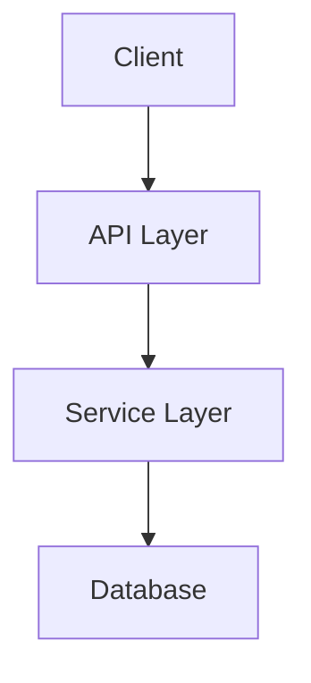

# Agentic SDLC Framework — Research & Architecture Document

> **Status:** Complete  
> **Author:** Generated via GitHub Copilot Agentic Workflow Builder  
> **Date:** 2025-07-15  
> **Use Case Anchor:** Data Dictionary on API Portal  
> **Scope:** Reusable, template-based SDLC framework using GitHub Agentic Workflows

---

## Table of Contents

1. [Executive Summary](#1-executive-summary)
2. [Agentic Workflow Design for SDLC](#2-agentic-workflow-design-for-sdlc)
3. [Multi-Agent Orchestration Patterns](#3-multi-agent-orchestration-patterns)
4. [Template Structure & Reusability](#4-template-structure--reusability)
5. [Safe Outputs & Security Architecture](#5-safe-outputs--security-architecture)
6. [Integration Points](#6-integration-points)
7. [Example Workflow Definitions](#7-example-workflow-definitions)
8. [Framework Blueprint & Directory Structure](#8-framework-blueprint--directory-structure)
9. [Use Case Plug-In: Data Dictionary](#9-use-case-plug-in-data-dictionary)
10. [Use Case Plug-In: API Gateway Setup](#10-use-case-plug-in-api-gateway-setup)
11. [Implementation Roadmap](#11-implementation-roadmap)

---

## 1. Executive Summary

GitHub Agentic Workflows (`gh-aw`) enable AI-powered automation inside GitHub Actions. Workflows are defined as **markdown files** with **YAML frontmatter** placed in `.github/workflows/`. The markdown body contains natural language instructions executed by an AI coding agent (Copilot, Claude, Codex, or Gemini). The `gh aw compile` command generates a `.lock.yml` GitHub Actions workflow file from the markdown source.

**Key insight for SDLC framework design:** Each SDLC phase (requirements → architecture → code → test → docs → deploy) maps to a discrete agentic workflow. These workflows chain together via `dispatch-workflow` safe-outputs, creating an automated pipeline where each phase's output triggers the next phase. Template parameterization is achieved through `workflow_dispatch` inputs, issue templates, and repository-level configuration files that agents read at runtime.

### Why This Matters for the Data Dictionary Use Case

The Data Dictionary pipeline — OpenAPI spec → PostgreSQL schema → search UI — involves 6+ distinct SDLC phases, each with different tool requirements, permissions, and AI reasoning needs. An agentic SDLC framework allows us to:

1. **Define each phase as a self-contained markdown workflow** with its own tools, permissions, and safe-outputs
2. **Chain phases together** so completing one auto-triggers the next
3. **Swap in different project specifications** (different OpenAPI specs, different target databases) without changing the workflow definitions
4. **Maintain consistent quality** through standardized templates, safety constraints, and review gates

---

## 2. Agentic Workflow Design for SDLC

### 2.1 SDLC Phase Mapping

Each SDLC phase becomes an agentic workflow with specific characteristics:

| SDLC Phase | Trigger Pattern | Key Tools | Primary Safe-Outputs | Engine Recommendation |
|---|---|---|---|---|
| **Requirements** | `workflow_dispatch`, `issues:opened` | `web-fetch`, `github`, `edit` | `create-issue`, `add-comment` | `copilot` (general reasoning) |
| **Architecture** | `dispatch-workflow` from Requirements | `edit`, `bash`, `github` | `create-pull-request`, `create-issue` | `copilot` or `claude` (deep reasoning) |
| **Code Generation** | `dispatch-workflow` from Architecture, `label_command` | `edit`, `bash`, `github` | `create-pull-request` | `copilot` (code generation) |
| **Testing** | `pull_request:synchronize`, `dispatch-workflow` | `bash`, `edit`, `github`, `playwright` | `add-comment`, `add-labels` | `copilot` (test execution) |
| **Documentation** | `dispatch-workflow` from Code Gen, `schedule:daily` | `edit`, `bash`, `web-fetch` | `create-pull-request`, `create-issue` | `copilot` (writing) |
| **Deployment** | `label_command:deploy`, `manual-approval` | `bash`, MCP servers | `dispatch-workflow`, `add-comment` | `copilot` (ops) |

### 2.2 Frontmatter Configuration Per Phase

#### Common Frontmatter Pattern (all phases share this base)

```yaml
---
description: "<Phase Name> - <Project Name> SDLC"
on:
  # Phase-specific trigger here
permissions:
  contents: read        # Always start read-only
  issues: read          # Most phases need issue context
  pull-requests: read   # Most phases need PR context
tools:
  edit:                           # File read/write
  bash: ["echo", "ls", "cat", "grep", "find", "git"]  # Safe subset
  github:
    toolsets: [repos, issues]     # Phase-specific toolsets
safe-outputs:
  # Phase-specific safe outputs with limits
engine: copilot                   # Default — no API key needed
network:
  allowed:
    - defaults
timeout-minutes: 20
---
```

#### Phase-Specific Frontmatter Differences

**Requirements Phase** — needs web access for research, issues for tracking:
```yaml
tools:
  web-fetch:              # Fetch external specs, docs
  web-search:             # Research patterns, standards
  github:
    toolsets: [repos, issues]
safe-outputs:
  create-issue:
    max: 10
    title-prefix: "[req]"
    labels: [requirements, auto-generated]
  add-comment:
    max: 5
```

**Architecture Phase** — needs deep file analysis, PR creation:
```yaml
tools:
  edit:
  bash: ["echo", "ls", "cat", "grep", "find", "tree", "git"]
  github:
    toolsets: [repos, issues, pull_requests]
safe-outputs:
  create-pull-request:
    max: 1
    title-prefix: "[arch]"
    labels: [architecture, auto-generated]
  create-issue:
    max: 5
    title-prefix: "[arch-decision]"
```

**Code Generation Phase** — needs full editor and build tools:
```yaml
tools:
  edit:
  bash: ["echo", "ls", "cat", "grep", "find", "git", "java", "mvn", "gradle"]
  github:
    toolsets: [repos, issues, pull_requests]
safe-outputs:
  create-pull-request:
    max: 1
    title-prefix: "[codegen]"
    labels: [code-generation, auto-generated]
network:
  allowed:
    - defaults
    - maven                   # Maven Central / Gradle repository access
```

**Testing Phase** — needs test runners and browser automation:
```yaml
tools:
  edit:
  bash: ["echo", "ls", "cat", "grep", "find", "git", "java", "mvn", "gradle"]
  # Selenium or Playwright for Java used via Maven/Gradle test dependencies
  github:
    toolsets: [repos, pull_requests]
safe-outputs:
  add-comment:
    max: 3
  add-labels:
    allowed: [tests-passing, tests-failing, needs-review]
    max: 2
```

### 2.3 Trigger Patterns for SDLC Phases

#### Pattern A: Linear Pipeline (Dispatch Chain)

Each phase dispatches the next. Best for greenfield projects.

```
workflow_dispatch → Requirements → dispatch → Architecture → dispatch → Code Gen → dispatch → Testing → dispatch → Docs → dispatch → Deploy
```

#### Pattern B: Event-Driven (React to Changes)

Each phase triggers on natural repository events. Best for ongoing development.

```
issue:opened → Requirements Analysis
pull_request:opened → Architecture Review  
pull_request:synchronize → Testing
push:main → Documentation Update
label_command:deploy → Deployment
```

#### Pattern C: Hybrid (Manual Gates + Automation)

Combine automatic triggers with human approval gates. Best for production systems.

```
workflow_dispatch → Requirements → creates issue for review
label_command:approved → Architecture → creates PR
pull_request:opened → Testing (automatic)
manual-approval:staging → Deployment
```

### 2.4 Engine and Model Selection Per Phase

```yaml
# Requirements — needs broad reasoning, web research
engine:
  id: copilot
  model: gpt-4.1           # Strong reasoning for requirements extraction

# Architecture — needs deep technical reasoning
engine:
  id: copilot
  model: claude-sonnet-4    # Excellent at system design

# Code Generation — needs fast, accurate code output
engine:
  id: copilot
  model: gpt-4.1           # Fast, high-quality code generation

# Testing — needs code understanding and test generation
engine:
  id: copilot
  model: claude-sonnet-4    # Good at understanding test scenarios

# Documentation — needs clear writing
engine:
  id: copilot
  model: gpt-4.1           # Clean, structured writing

# Deployment — needs precise operational reasoning
engine:
  id: copilot
  model: gpt-4.1           # Reliable for operational tasks
```

---

## 3. Multi-Agent Orchestration Patterns

### 3.1 Workflow Chaining with `dispatch-workflow`

The primary mechanism for chaining agentic workflows is the `dispatch-workflow` safe-output. When one workflow completes, it can trigger another workflow by dispatching a `workflow_dispatch` event.

**How it works:**

1. Workflow A runs and produces results (files, issues, analysis)
2. Workflow A uses `dispatch-workflow` safe-output to trigger Workflow B
3. Workflow B receives the dispatch event and reads the artifacts produced by A

**Workflow A (Requirements) — dispatches Architecture:**
```yaml
---
on:
  workflow_dispatch:
    inputs:
      spec-path:
        description: 'Path to OpenAPI spec or project spec'
        required: true
        type: string
safe-outputs:
  create-issue:
    max: 10
    title-prefix: "[req]"
  dispatch-workflow:
    max: 1
---

# Requirements Extraction

Analyze the specification at ${{ github.event.inputs.spec-path }}.
Extract requirements and create issues for each.

When done, dispatch the `architecture-design` workflow with input
`spec-path` set to the same spec path.
```

**Workflow B (Architecture) — receives dispatch:**
```yaml
---
on:
  workflow_dispatch:
    inputs:
      spec-path:
        description: 'Path to project spec'
        required: true
        type: string
---

# Architecture Design

Read the requirements issues created by the requirements phase.
Design the architecture based on the specification at ${{ github.event.inputs.spec-path }}.
```

### 3.2 Context Passing Between Workflows

Since each workflow runs as a separate GitHub Actions job, context passing happens through **repository artifacts**:

| Method | Best For | How |
|---|---|---|
| **Issue bodies** | Requirements, decisions, status | Workflow A creates issues; Workflow B reads them via `github` toolset |
| **PR descriptions** | Architecture docs, code reviews | Workflow A creates PR with context in description |
| **Repository files** | Specs, configs, generated code | Workflow A commits files to a branch; Workflow B reads them |
| **Labels** | Status tracking, phase gating | Workflow A adds labels; Workflow B filters by label |
| **Dispatch inputs** | Small parameters | Pass as `workflow_dispatch` inputs (strings only) |
| **`cache-memory` tool** | Cross-run state within one workflow | Persistent key-value store across runs |
| **`repo-memory` tool** | Cross-workflow state within one repo | Repository-scoped persistent memory |

**Recommended pattern for SDLC:**

```
Requirements Workflow:
  → Creates issues with label "phase:requirements" and "status:complete"
  → Creates a tracking issue with all requirement IDs
  → Dispatches architecture workflow with tracking-issue-number as input

Architecture Workflow:
  → Reads tracking issue to find all requirement issues
  → Creates architecture docs in docs/architecture/
  → Creates PR with architecture for review
  → Dispatches code-gen workflow when PR is merged (via separate trigger)
```

### 3.3 Parallel Execution (Fan-Out / Fan-In)

**Fan-Out Pattern:** One workflow dispatches multiple independent workflows in parallel.

```yaml
---
safe-outputs:
  dispatch-workflow:
    max: 5          # Allow up to 5 downstream dispatches
---

# Orchestrator

After analyzing the spec, dispatch these workflows in parallel:
1. `codegen-backend` — Generate the API layer
2. `codegen-frontend` — Generate the UI layer  
3. `codegen-database` — Generate the schema/migrations
4. `codegen-tests` — Generate the test suite
```

**Fan-In Pattern:** A coordination workflow waits for all parallel workflows to complete.

```yaml
---
on:
  workflow_run:
    workflows: [codegen-backend, codegen-frontend, codegen-database, codegen-tests]
    types: [completed]
---

# Integration Coordinator

Check if ALL code generation workflows have completed successfully.
Use the GitHub API to query workflow run status.
If all passed, dispatch the `integration-testing` workflow.
If any failed, create an issue with failure details.
```

> **Note:** `workflow_run` is a standard GitHub Actions trigger that fires when a referenced workflow completes. Combined with the `github` toolset, the agent can query run status and decide next actions.

### 3.4 Feedback Loop Pattern

Test results feed back into code generation for auto-fix:

```
Code Gen PR → Testing Workflow → 
  IF tests pass → add label "tests-passing" → merge
  IF tests fail → dispatch "code-fix" workflow with test output → 
    Code Fix creates new commit → Testing re-triggers → loop
```

```yaml
---
on:
  workflow_dispatch:
    inputs:
      pr-number:
        description: 'PR to fix'
        required: true
      test-output:
        description: 'Test failure details'
        required: true
safe-outputs:
  push-to-pull-request-branch:
    max: 3          # Limit fix attempts
---

# Code Fix Agent

Read the test failures from the dispatch input.
Analyze the code in PR #${{ github.event.inputs.pr-number }}.
Fix the failing tests by modifying the source code.
Push the fix to the PR branch.
```

### 3.5 Orchestration with Sub-Issues

For complex projects, use GitHub's sub-issue linking:

```yaml
safe-outputs:
  create-issue:
    max: 20
    title-prefix: "[task]"
  link-sub-issue:
    max: 20
```

The orchestrator creates a parent tracking issue and links all phase-specific issues as sub-issues, providing a natural project board view.

---

## 4. Template Structure & Reusability

### 4.1 Template Parameterization Strategy

The framework achieves reusability through **three layers of parameterization**:

#### Layer 1: Workflow Dispatch Inputs (Runtime Parameters)

```yaml
on:
  workflow_dispatch:
    inputs:
      project-name:
        description: 'Project identifier'
        required: true
        type: string
      spec-path:
        description: 'Path to project specification'
        required: true
        type: string
      tech-stack:
        description: 'Technology stack (java-spring, python, dotnet)'
        required: true
        type: choice
        options: [java-spring, python, dotnet]
      target-db:
        description: 'Target database (postgresql, mysql, cosmosdb)'
        required: false
        type: choice
        options: [postgresql, mysql, cosmosdb]
        default: postgresql
```

#### Layer 2: Repository Configuration Files (Project-Level Config)

Store project-specific configuration in a standard location that all workflows read:

```
.github/
  sdlc-config.yaml          # Framework configuration
  project-specs/
    data-dictionary.yaml     # Data Dictionary project spec
    api-gateway.yaml         # API Gateway project spec
```

**`.github/sdlc-config.yaml`:**
```yaml
framework:
  version: "1.0"
  default-engine: copilot
  default-timeout: 30

projects:
  data-dictionary:
    spec: .github/project-specs/data-dictionary.yaml
    tech-stack: java-spring
    target-db: postgresql
    phases: [requirements, architecture, codegen, testing, docs, deploy]
    
  api-gateway:
    spec: .github/project-specs/api-gateway.yaml
    tech-stack: java-spring
    phases: [requirements, architecture, codegen, testing, deploy]
```

The agent reads this file at runtime:
```markdown
## Instructions

1. Read `.github/sdlc-config.yaml` to understand the project configuration
2. Read the project specification file referenced in the config
3. Execute this phase using the project-specific parameters
```

#### Layer 3: Agent Definitions (Persona Templates)

Store reusable agent personas in `.github/agents/`:

```
.github/agents/
  requirements-analyst.agent.md
  solutions-architect.agent.md
  senior-developer.agent.md
  qa-engineer.agent.md
  technical-writer.agent.md
  devops-engineer.agent.md
```

Reference agents from workflows:
```yaml
engine:
  id: copilot
  agent: requirements-analyst    # References .github/agents/requirements-analyst.agent.md
```

### 4.2 Where to Store Templates

**Option A: Single Repository (Recommended for Starting)**

All templates live in the same repository as the project:

```
my-project/
  .github/
    workflows/
      01-requirements.md          # Workflow definitions
      01-requirements.lock.yml    # Compiled workflows
      02-architecture.md
      02-architecture.lock.yml
      ...
    agents/
      requirements-analyst.agent.md
      solutions-architect.agent.md
      ...
    sdlc-config.yaml
    project-specs/
      data-dictionary.yaml
  src/                            # Generated source code
  docs/                           # Generated documentation
  tests/                          # Generated tests
```

**Option B: Organization Template Repository (Recommended for Scale)**

A central template repo that other repos install from:

```
org/sdlc-agentic-templates/           # Template source repo
  workflows/
    requirements.md
    architecture.md
    codegen.md
    testing.md
    docs.md
    deploy.md
  agents/
    requirements-analyst.agent.md
    ...

org/my-project/                        # Consumer repo
  .github/
    workflows/
      requirements.md                  # Installed via: gh aw add org/sdlc-agentic-templates/workflows/requirements.md
      requirements.lock.yml
    sdlc-config.yaml                   # Project-specific config
```

Install templates using `gh aw add`:
```bash
gh aw add org/sdlc-agentic-templates/workflows/requirements.md
gh aw add org/sdlc-agentic-templates/workflows/architecture.md
# ... etc
```

### 4.3 Versioning Templates

**Using `source:` frontmatter key:**

When a workflow is installed from a template, it records its origin:

```yaml
source: org/sdlc-agentic-templates/workflows/requirements.md@v1.2.0
```

This enables:
- **Tracking** which version of the template is in use
- **Updating** when new template versions are released
- **Auditing** which projects use which template versions

**Using git tags on the template repo:**

```bash
# In the template repo
git tag v1.0.0
git push origin v1.0.0

# In consumer repos, install specific versions
gh aw add org/sdlc-agentic-templates/workflows/requirements.md@v1.0.0
```

### 4.4 Variable Substitution Patterns

Agentic workflows don't have traditional variable substitution like Jinja or Handlebars. Instead, the AI agent reads configuration at runtime:

**Pattern: Config-Driven Agent Instructions**

```markdown
# Code Generation

## Setup

1. Read `.github/sdlc-config.yaml` to determine:
   - `tech-stack` — which language/framework to use
   - `target-db` — which database to target
   - `project-name` — for naming conventions

2. Read the project specification referenced in the config.

## Instructions

Based on the tech-stack configuration:

### If tech-stack is `java-spring`:
- Use Java 21+ with Spring Boot 3.x
- Use Spring Web (Spring MVC) for HTTP server
- Use Spring Data JPA / Hibernate for ORM
- Use Jakarta Bean Validation (Hibernate Validator) for validation

### If tech-stack is `python`:
- Use Python 3.12+ with type hints
- Use FastAPI for HTTP server
- Use SQLAlchemy for ORM
- Use Pydantic for validation

### If tech-stack is `dotnet`:
- Use .NET 8 with C#
- Use ASP.NET Core for HTTP server
- Use Entity Framework Core for ORM
- Use FluentValidation for validation
```

This approach works because the AI agent is intelligent enough to read configuration and adapt its behavior — no string interpolation needed.

---

## 5. Safe Outputs & Security Architecture

### 5.1 Defense-in-Depth Security Model

GitHub Agentic Workflows enforce a strict security architecture:

```
┌─────────────────────────────────────────────────────┐
│                 GitHub Actions Runner                 │
│  ┌───────────────────────────────────────────────┐  │
│  │            Agent Job (Read-Only)               │  │
│  │  • permissions: contents: read                 │  │
│  │  • Cannot write to repo, issues, PRs directly  │  │
│  │  • Runs AI agent with natural language prompt   │  │
│  │  • Produces "output requests" for safe-outputs  │  │
│  └─────────────────┬─────────────────────────────┘  │
│                    │ Output Requests                  │
│                    ▼                                  │
│  ┌───────────────────────────────────────────────┐  │
│  │         Threat Detection Layer                 │  │
│  │  • AI-powered analysis of agent output         │  │
│  │  • Content sanitization                        │  │
│  │  • Rate limiting (max counts)                  │  │
│  └─────────────────┬─────────────────────────────┘  │
│                    │ Sanitized Requests               │
│                    ▼                                  │
│  ┌───────────────────────────────────────────────┐  │
│  │       Safe-Output Jobs (Write Permissions)     │  │
│  │  • Each safe-output runs in its own job        │  │
│  │  • Minimal permissions per job                 │  │
│  │  • Pre-approved operation types only            │  │
│  └───────────────────────────────────────────────┘  │
│                                                      │
│  ┌───────────────────────────────────────────────┐  │
│  │       Agent Workflow Firewall (AWF)            │  │
│  │  • Network egress control via Squid proxy      │  │
│  │  • Only explicitly allowed domains reachable   │  │
│  │  • Blocks exfiltration of secrets/code          │  │
│  └───────────────────────────────────────────────┘  │
└─────────────────────────────────────────────────────┘
```

### 5.2 Safe-Outputs for Generated Code

For an SDLC framework that generates code, the critical safe-output is `create-pull-request`:

```yaml
safe-outputs:
  create-pull-request:
    max: 1                              # Only one PR per run
    title-prefix: "[codegen]"           # Clear identification
    labels: [auto-generated, needs-review]  # Ensure human review
    # The PR is created as a DRAFT by default
    # Human must review and approve before merge
```

**Why this is safe:**
- The agent **cannot merge its own PR** — a human must review and approve
- The PR is clearly labeled as auto-generated
- The `max: 1` limit prevents the agent from creating multiple PRs
- All code changes are visible in the PR diff for review

**For iterative code fixes:**
```yaml
safe-outputs:
  push-to-pull-request-branch:
    max: 5                              # Allow up to 5 fix commits
    # Pushes to an EXISTING PR branch only
    # Cannot create new branches or PRs
```

### 5.3 Permissions Matrix for SDLC Phases

| Phase | `contents` | `issues` | `pull-requests` | `actions` | `discussions` |
|---|---|---|---|---|---|
| Requirements | `read` | `read` | — | — | `read` |
| Architecture | `read` | `read` | `read` | — | — |
| Code Generation | `read` | `read` | `read` | — | — |
| Testing | `read` | `read` | `read` | `read` | — |
| Documentation | `read` | `read` | `read` | — | — |
| Deployment | `read` | `read` | `read` | `read` | — |

> **Note:** All phases use `read` permissions only. Write operations happen exclusively through safe-outputs in separate, permission-controlled jobs.

### 5.4 Secret Management

```yaml
# MCP servers can access secrets via environment variables
mcp-servers:
  database:
    command: "java"
    args: ["-jar", "mcp-server-postgres.jar"]
    env:
      DATABASE_URL: "${{ secrets.DATABASE_URL }}"
    allowed: ["query", "list_tables"]   # Restrict to read-only operations

# Never expose secrets directly to the agent
# The agent communicates with external systems ONLY through MCP servers
# MCP servers have their own allowed-tool restrictions
```

### 5.5 Role-Based Access Control

```yaml
on:
  workflow_dispatch:
    inputs:
      phase:
        description: 'SDLC phase to execute'
        required: true
  # Only admins and maintainers can trigger SDLC workflows
  roles: [admin, maintainer, write]
  # Skip bot-triggered events
  skip-bots: [github-actions, copilot, dependabot]
```

---

## 6. Integration Points

### 6.1 Integration with Existing CI/CD

Agentic workflows **complement** traditional CI/CD — they don't replace it.

```
Traditional CI/CD (GitHub Actions .yml):
  • Build → Test → Lint → Deploy
  • Deterministic, fast, well-understood
  • Handles: compilation, unit tests, static analysis, container builds

Agentic Workflows (.md → .lock.yml):
  • Requirements analysis, code generation, code review, documentation
  • AI-powered reasoning, natural language processing
  • Handles: creative tasks, analysis, generation, triage

Integration pattern:
  Agentic Workflow (generate code) → Creates PR →
  Traditional CI (build & test) → Reports status →
  Agentic Workflow (fix failures if any) → Updates PR →
  Human reviews → Merges
```

**Concrete integration example:**

```yaml
# Traditional CI runs on the PR created by agentic workflow
# .github/workflows/ci.yml (traditional GitHub Actions)
name: CI
on:
  pull_request:
    types: [opened, synchronize]
jobs:
  build-and-test:
    runs-on: ubuntu-latest
    steps:
      - uses: actions/checkout@v4
      - uses: actions/setup-java@v4
        with:
          distribution: 'temurin'
          java-version: '21'
      - run: ./mvnw verify
```

```yaml
# Agentic workflow reacts to CI failures
# .github/workflows/auto-fix.md
---
on:
  workflow_run:
    workflows: [CI]
    types: [completed]
safe-outputs:
  push-to-pull-request-branch:
    max: 3
---

# Auto-Fix CI Failures

If the CI workflow failed, analyze the failure logs and fix the code.
```

### 6.2 Integration with Copilot CLI Skills

The Copilot CLI and Copilot Chat in VS Code work alongside agentic workflows:

| Tool | Role in SDLC | Integration |
|---|---|---|
| **Copilot CLI** (`gh copilot`) | Developer's local assistant | Developers use CLI to understand generated code, get explanations |
| **Copilot Chat (VS Code)** | Interactive development | Developers refine generated code with Copilot Chat suggestions |
| **Custom Agents** (`.github/agents/`) | Persona definitions | Shared between VS Code Copilot Chat and agentic workflows |
| **Agentic Workflows** | Automated pipeline | Runs on GitHub Actions, no human interaction required |

**Shared agent definitions:**

```
.github/agents/
  senior-developer.agent.md     # Used by BOTH:
                                  # - VS Code Copilot Chat (interactive)
                                  # - Agentic Workflows (automated)
```

### 6.3 Integration with Issue Tracking & Project Boards

```yaml
safe-outputs:
  create-issue:
    max: 20
    title-prefix: "[sdlc]"
    labels: [auto-generated]
  link-sub-issue:
    max: 20
  update-project:
    max: 10
  assign-milestone:
    max: 10
```

The SDLC framework creates a natural project management structure:

```
📋 Project Board: "Data Dictionary SDLC"
│
├── 📌 Epic: "Data Dictionary on API Portal" (tracking issue)
│   ├── 📝 [req] Parse OpenAPI spec endpoints
│   ├── 📝 [req] Extract field definitions
│   ├── 📝 [req] Define search requirements
│   ├── 🏗️ [arch] Database schema design
│   ├── 🏗️ [arch] API layer design
│   ├── 🏗️ [arch] Search indexing strategy
│   ├── 💻 [codegen] Backend API implementation
│   ├── 💻 [codegen] Database migrations
│   ├── 💻 [codegen] Search UI components
│   ├── 🧪 [test] API integration tests
│   ├── 🧪 [test] Search functionality tests
│   ├── 📖 [docs] API documentation
│   └── 🚀 [deploy] Deployment configuration
```

### 6.4 Feedback Loop: Test Results → Code Updates

```yaml
# Testing workflow detects failures and triggers code fix
---
on:
  pull_request:
    types: [opened, synchronize]
safe-outputs:
  add-comment:
    max: 3
  add-labels:
    allowed: [tests-passing, tests-failing]
  dispatch-workflow:
    max: 1
---

# Test Runner

Run the test suite. If tests fail:
1. Add the `tests-failing` label
2. Post a comment with detailed failure analysis
3. Dispatch the `auto-fix` workflow with the PR number and failure details

If tests pass:
1. Add the `tests-passing` label  
2. Post a summary comment
```

---

## 7. Example Workflow Definitions

### 7.1 Requirements Extraction Workflow

```markdown
---
description: "SDLC Phase 1: Extract and document requirements from project specification"
on:
  workflow_dispatch:
    inputs:
      project-name:
        description: 'Project identifier from sdlc-config.yaml'
        required: true
        type: string
      spec-path:
        description: 'Path to project specification file'
        required: true
        type: string
  roles: [admin, maintainer, write]
permissions:
  contents: read
  issues: read
tools:
  edit:
  bash: ["echo", "ls", "cat", "grep", "find", "jq", "git"]
  github:
    toolsets: [repos, issues]
  web-fetch:
safe-outputs:
  create-issue:
    max: 25
    title-prefix: "[req]"
    labels: [requirements, phase-1, auto-generated]
  link-sub-issue:
    max: 25
  add-comment:
    max: 5
  dispatch-workflow:
    max: 1
engine: copilot
network:
  allowed:
    - defaults
timeout-minutes: 30
---

# Requirements Extraction Agent

You are a Senior Business Analyst extracting requirements from a project specification.

## Context

- **Project:** ${{ github.event.inputs.project-name }}
- **Specification:** ${{ github.event.inputs.spec-path }}
- **Repository:** ${{ github.repository }}

## Instructions

### Step 1: Read Configuration
Read `.github/sdlc-config.yaml` to understand the project configuration.
Read the specification file at `${{ github.event.inputs.spec-path }}`.

### Step 2: Analyze Specification
Parse the specification and extract:
- **Functional requirements** — What the system must DO
- **Non-functional requirements** — Performance, security, scalability constraints
- **Data requirements** — Entities, relationships, validation rules
- **Integration requirements** — External systems, APIs, data sources
- **User interface requirements** — Screens, flows, components

### Step 3: Create Tracking Issue
Create a parent tracking issue titled "[req] ${{ github.event.inputs.project-name }} — Requirements"
with a checklist of all identified requirements.

### Step 4: Create Requirement Issues
For each requirement, create a separate issue with:
- **Title:** `[req] <Concise requirement description>`
- **Body:** 
  - Description of the requirement
  - Acceptance criteria (Given/When/Then format)
  - Priority (P0-Critical, P1-High, P2-Medium, P3-Low)
  - Estimated complexity (S, M, L, XL)
  - Dependencies on other requirements
- Link each requirement issue as a sub-issue of the tracking issue.

### Step 5: Dispatch Next Phase
After all requirements are created, dispatch the `architecture-design` workflow
with inputs:
- `project-name`: "${{ github.event.inputs.project-name }}"
- `tracking-issue`: <number of the tracking issue>

## Constraints
- Maximum 25 requirement issues per run
- Each requirement must have clear, testable acceptance criteria
- Use Given/When/Then format for acceptance criteria
- Prioritize requirements using MoSCoW method (Must/Should/Could/Won't)
```

### 7.2 Architecture Design Workflow

```markdown
---
description: "SDLC Phase 2: Design system architecture based on requirements"
on:
  workflow_dispatch:
    inputs:
      project-name:
        description: 'Project identifier'
        required: true
        type: string
      tracking-issue:
        description: 'Requirements tracking issue number'
        required: true
        type: string
permissions:
  contents: read
  issues: read
  pull-requests: read
tools:
  edit:
  bash: ["echo", "ls", "cat", "grep", "find", "tree", "git", "mkdir"]
  github:
    toolsets: [repos, issues, pull_requests]
safe-outputs:
  create-pull-request:
    max: 1
    title-prefix: "[arch]"
    labels: [architecture, phase-2, auto-generated, needs-review]
  create-issue:
    max: 10
    title-prefix: "[arch-decision]"
    labels: [architecture, adr]
  add-comment:
    max: 5
engine:
  id: copilot
  model: claude-sonnet-4
network:
  allowed:
    - defaults
timeout-minutes: 30
---

# Architecture Design Agent

You are a Solutions Architect designing the system architecture for a software project.

## Context

- **Project:** ${{ github.event.inputs.project-name }}
- **Requirements Tracking Issue:** #${{ github.event.inputs.tracking-issue }}

## Instructions

### Step 1: Gather Requirements
Read the requirements tracking issue #${{ github.event.inputs.tracking-issue }}.
Follow all linked sub-issues to understand every requirement.
Read `.github/sdlc-config.yaml` for project configuration (tech stack, database, etc.).

### Step 2: Design Architecture
Based on the requirements and tech stack, design:

1. **System Architecture** — High-level component diagram (described in text/mermaid)
2. **Data Model** — Entity relationships, database schema design
3. **API Design** — Endpoints, request/response schemas, error handling
4. **Directory Structure** — Project file/folder organization
5. **Technology Decisions** — Specific libraries, frameworks, patterns

### Step 3: Create Architecture Decision Records (ADRs)
For each significant technology decision, create an issue with:
- **Title:** `[arch-decision] <Decision Title>`
- **Body:** ADR format (Context, Decision, Consequences)

### Step 4: Create Architecture PR
Create a PR with the following files:
- `docs/architecture/ARCHITECTURE.md` — System overview with diagrams
- `docs/architecture/DATA-MODEL.md` — Database schema and entity documentation
- `docs/architecture/API-DESIGN.md` — API endpoint specifications
- `docs/architecture/DIRECTORY-STRUCTURE.md` — Project file structure
- `docs/architecture/adrs/` — Architecture decision records

### Step 5: Add Review Comment
Comment on the tracking issue with a summary of the architecture design
and a link to the architecture PR.

## Output Format

Use Mermaid diagrams for visual representations:


## Constraints
- Follow the 12-Factor App methodology
- Design for horizontal scalability
- Include security considerations in every component
- All database access must go through an ORM/query builder
- APIs must follow REST conventions with proper status codes
```

### 7.3 Code Generation Workflow

```markdown
---
description: "SDLC Phase 3: Generate implementation code from architecture"
on:
  workflow_dispatch:
    inputs:
      project-name:
        description: 'Project identifier'
        required: true
        type: string
      arch-branch:
        description: 'Architecture branch name to build from'
        required: true
        type: string
  label_command: generate-code
permissions:
  contents: read
  issues: read
  pull-requests: read
tools:
  edit:
  bash: ["echo", "ls", "cat", "grep", "find", "tree", "git", "mkdir",
         "java", "mvn", "gradle", "javac"]
  github:
    toolsets: [repos, issues, pull_requests]
safe-outputs:
  create-pull-request:
    max: 1
    title-prefix: "[codegen]"
    labels: [code-generation, phase-3, auto-generated, needs-review]
  add-comment:
    max: 3
engine: copilot
runtimes:
  java: "21"
network:
  allowed:
    - defaults
    - maven
timeout-minutes: 45
---

# Code Generation Agent

You are a Senior Software Engineer generating production-quality code from architecture specifications.

## Context

- **Project:** ${{ github.event.inputs.project-name }}
- **Architecture Branch:** ${{ github.event.inputs.arch-branch }}

## Instructions

### Step 1: Read Architecture
Check out the architecture branch and read all architecture documents:
- `docs/architecture/ARCHITECTURE.md`
- `docs/architecture/DATA-MODEL.md`
- `docs/architecture/API-DESIGN.md`
- `docs/architecture/DIRECTORY-STRUCTURE.md`

Read `.github/sdlc-config.yaml` for tech stack configuration.

### Step 2: Initialize Project
Based on the tech stack:
- Initialize the project structure (pom.xml or build.gradle, application.properties, etc.)
- Resolve core dependencies via Maven/Gradle
- Set up Checkstyle and SpotBugs configuration
- Create the directory structure from the architecture spec

### Step 3: Generate Code
Generate the following in order:

1. **Data Layer**
   - Database schema/migrations (Flyway or Liquibase migration scripts)
   - JPA Entity classes with Jakarta Persistence annotations
   - Spring Data JPA Repository interfaces

2. **Service Layer**
   - Business logic services
   - Jakarta Bean Validation constraints and custom validators
   - Error handling utilities

3. **API Layer**
   - Route handlers/controllers
   - Middleware (auth, logging, error handling)
   - Request/response DTOs

4. **Configuration**
   - Environment configuration
   - Database connection setup
   - Server initialization

### Step 4: Create PR
Create a single PR with all generated code.
Include a comprehensive PR description with:
- Summary of what was generated
- How to run the project locally
- Known limitations or TODOs
- Dependencies installed

## Constraints
- All Java code must target Java 21+ (use records, sealed classes, pattern matching where appropriate)
- Use Spring's constructor-based dependency injection
- Every public method must have Javadoc comments
- Follow standard Maven/Gradle project layout (src/main/java, src/test/java)
- Use Spring's @Component / @Service / @Repository stereotypes
- Include proper exception handling with custom exception hierarchy
- Use strong typing — avoid raw types and unchecked casts
```

### 7.4 Testing Workflow

```markdown
---
description: "SDLC Phase 4: Generate and run tests for generated code"
on:
  pull_request:
    types: [opened, synchronize]
  workflow_dispatch:
    inputs:
      pr-number:
        description: 'PR number to test'
        required: true
        type: string
permissions:
  contents: read
  issues: read
  pull-requests: read
tools:
  edit:
  bash: ["echo", "ls", "cat", "grep", "find", "git",
         "java", "mvn", "gradle"]
  # Selenium or Playwright for Java used via Maven/Gradle test dependencies
  github:
    toolsets: [repos, pull_requests]
safe-outputs:
  add-comment:
    max: 3
    hide-older-comments: true
  add-labels:
    allowed: [tests-passing, tests-failing, needs-test-fix, coverage-low]
    max: 3
  remove-labels:
    max: 3
  dispatch-workflow:
    max: 1
engine: copilot
runtimes:
  java: "21"
network:
  allowed:
    - defaults
    - maven
timeout-minutes: 30
---

# Testing Agent

You are a QA Engineer responsible for testing generated code.

## Context

- **PR:** #${{ github.event.pull_request.number || github.event.inputs.pr-number }}
- **Branch:** ${{ github.head_ref }}

## Instructions

### Step 1: Analyze Code
Read the PR diff to understand what code was generated.
Identify all modules, services, and API endpoints that need testing.

### Step 2: Generate Tests
Create comprehensive tests:

1. **Unit Tests** — For each service/utility function
   - Happy path scenarios
   - Edge cases (empty input, null values, boundary conditions)
   - Error scenarios

2. **Integration Tests** — For API endpoints
   - Request/response validation
   - Error handling
   - Authentication/authorization

3. **Database Tests** — For data layer
   - CRUD operations
   - Query correctness
   - Migration up/down

### Step 3: Run Tests
Execute the test suite:
```bash
./mvnw verify -Djacoco.enabled=true
```

### Step 4: Report Results
Post a comment on the PR with:
- ✅/❌ Test results summary
- 📊 Coverage report (lines, branches, functions)
- 🔍 Uncovered areas that need attention
- 💡 Suggestions for additional test cases

### Step 5: Label and Dispatch
- If all tests pass with >80% coverage: add `tests-passing` label
- If tests fail: add `tests-failing` label, dispatch `auto-fix` workflow
- If coverage <80%: add `coverage-low` label

## Constraints
- Test classes must follow Maven convention in src/test/java mirroring src/main/java (*Test.java, *IT.java)
- Use descriptive test names: "should [expected behavior] when [condition]"
- Mock external dependencies (database, external APIs)
- Do not test third-party library internals
- Each test must be independent and idempotent
```

### 7.5 Documentation Workflow

```markdown
---
description: "SDLC Phase 5: Generate project documentation"
on:
  workflow_dispatch:
    inputs:
      project-name:
        description: 'Project identifier'
        required: true
        type: string
  schedule: weekly on friday around 14:00
permissions:
  contents: read
  issues: read
  pull-requests: read
tools:
  edit:
  bash: ["echo", "ls", "cat", "grep", "find", "tree", "git", "mkdir"]
  github:
    toolsets: [repos, issues, pull_requests]
  web-fetch:
safe-outputs:
  create-pull-request:
    max: 1
    title-prefix: "[docs]"
    labels: [documentation, phase-5, auto-generated]
  add-comment:
    max: 3
engine: copilot
network:
  allowed:
    - defaults
timeout-minutes: 30
---

# Documentation Agent

You are a Technical Writer creating comprehensive project documentation.

## Context

- **Project:** ${{ github.event.inputs.project-name || 'auto-detect' }}
- **Repository:** ${{ github.repository }}

## Instructions

### Step 1: Analyze Codebase
Scan the entire repository to understand:
- Project structure and organization
- API endpoints and their contracts
- Database schema and relationships
- Configuration options
- Dependencies and their purposes

### Step 2: Generate Documentation

1. **README.md** — Project overview, quick start guide, architecture summary
2. **docs/API.md** — Complete API reference with examples
3. **docs/DATABASE.md** — Schema documentation, ER diagrams (mermaid)
4. **docs/DEVELOPMENT.md** — Developer setup, coding standards, workflow
5. **docs/DEPLOYMENT.md** — Deployment procedures, environment configuration
6. **docs/CHANGELOG.md** — Auto-generated from git history and PR descriptions

### Step 3: Validate Documentation
- Ensure all API endpoints are documented
- Verify code examples compile/run
- Check all links are valid
- Ensure setup instructions are complete

### Step 4: Create PR
Create a PR with all documentation updates.

## Constraints
- Use clear, concise language (8th-grade reading level)
- Include code examples for every API endpoint
- Use Mermaid diagrams for visual representations
- Follow the Diátaxis documentation framework (tutorials, how-to, reference, explanation)
- Every public function must appear in the API reference
```

### 7.6 Deployment Workflow

```markdown
---
description: "SDLC Phase 6: Deploy to target environment"
on:
  label_command: deploy-staging
  workflow_dispatch:
    inputs:
      environment:
        description: 'Target environment'
        required: true
        type: choice
        options: [staging, production]
      version:
        description: 'Version tag to deploy'
        required: true
        type: string
  roles: [admin, maintainer]
  manual-approval: staging
permissions:
  contents: read
  issues: read
  actions: read
tools:
  bash: ["echo", "ls", "cat", "grep", "find", "git", "java", "mvn", "docker"]
  github:
    toolsets: [repos, issues, pull_requests]
safe-outputs:
  add-comment:
    max: 5
  create-issue:
    max: 1
    title-prefix: "[deploy]"
    labels: [deployment, ops]
  dispatch-workflow:
    max: 1
engine: copilot
network:
  allowed:
    - defaults
    - maven
timeout-minutes: 30
---

# Deployment Agent

You are a DevOps Engineer managing deployments.

## Context

- **Environment:** ${{ github.event.inputs.environment || 'staging' }}
- **Version:** ${{ github.event.inputs.version || 'latest' }}

## Instructions

### Step 1: Pre-Deployment Checks
1. Verify all tests are passing on the target branch
2. Check that the version tag exists
3. Verify no active deployments are in progress
4. Review recent changes since last deployment

### Step 2: Generate Deployment Artifacts
1. Build the application for the target environment
2. Generate environment-specific configuration
3. Create/update Docker compose or Kubernetes manifests
4. Generate database migration scripts if needed

### Step 3: Deploy
Execute the deployment:
1. Run database migrations (if any)
2. Deploy application containers
3. Verify health checks pass
4. Run smoke tests

### Step 4: Post-Deployment
1. Create a deployment issue with:
   - Version deployed
   - Environment
   - Changes included
   - Deployment timestamp
   - Health check results
2. Comment on related PRs/issues that the deployment is complete

### Step 5: Rollback Plan
If deployment fails:
1. Document the failure
2. Execute rollback to previous version
3. Create an incident issue

## Constraints
- Never deploy directly to production without manual-approval gate
- Always run smoke tests after deployment
- Maintain deployment audit trail via issues
- Keep deployment duration under 15 minutes
```

---

## 8. Framework Blueprint & Directory Structure

### 8.1 Complete Directory Structure

```
sdlc-agentic-framework/
│
├── .github/
│   ├── workflows/                          # Agentic workflow definitions
│   │   ├── 01-requirements.md              # Phase 1: Requirements extraction
│   │   ├── 01-requirements.lock.yml        # Compiled workflow
│   │   ├── 02-architecture.md              # Phase 2: Architecture design
│   │   ├── 02-architecture.lock.yml
│   │   ├── 03-codegen.md                   # Phase 3: Code generation
│   │   ├── 03-codegen.lock.yml
│   │   ├── 04-testing.md                   # Phase 4: Test generation & execution
│   │   ├── 04-testing.lock.yml
│   │   ├── 05-documentation.md             # Phase 5: Documentation generation
│   │   ├── 05-documentation.lock.yml
│   │   ├── 06-deployment.md                # Phase 6: Deployment
│   │   ├── 06-deployment.lock.yml
│   │   ├── auto-fix.md                     # Feedback loop: auto-fix failures
│   │   ├── auto-fix.lock.yml
│   │   ├── orchestrator.md                 # Pipeline orchestrator
│   │   ├── orchestrator.lock.yml
│   │   ├── ci.yml                          # Traditional CI (build/test/lint)
│   │   └── cd.yml                          # Traditional CD (container build/push)
│   │
│   ├── agents/                             # Reusable agent personas
│   │   ├── requirements-analyst.agent.md
│   │   ├── solutions-architect.agent.md
│   │   ├── senior-developer.agent.md
│   │   ├── qa-engineer.agent.md
│   │   ├── technical-writer.agent.md
│   │   └── devops-engineer.agent.md
│   │
│   ├── prompts/                            # Reusable prompt fragments
│   │   ├── code-standards.prompt.md        # Shared coding standards
│   │   ├── security-checklist.prompt.md    # Security review checklist
│   │   └── review-guidelines.prompt.md     # Code review guidelines
│   │
│   ├── sdlc-config.yaml                    # Framework configuration
│   │
│   └── project-specs/                      # Project specifications
│       ├── data-dictionary.yaml            # Data Dictionary project
│       ├── api-gateway.yaml                # API Gateway project
│       └── _template.yaml                  # Template for new projects
│
├── docs/                                   # Generated documentation
│   ├── architecture/                       # Architecture decision records
│   ├── api/                                # API reference documentation
│   └── guides/                             # User and developer guides
│
├── src/
│   ├── main/
│   │   ├── java/                           # Java source code
│   │   │   └── com/example/project/
│   │   │       ├── controller/             # REST controllers (API layer)
│   │   │       ├── service/                # Business logic
│   │   │       ├── model/                  # JPA entities / domain models
│   │   │       ├── repository/             # Spring Data JPA repositories
│   │   │       └── config/                 # Spring configuration classes
│   │   └── resources/
│   │       ├── application.properties      # Spring Boot configuration
│   │       └── db/migration/              # Flyway migration scripts
│   └── test/
│       └── java/                           # Test source code
│           └── com/example/project/
│               ├── unit/                   # Unit tests (JUnit 5 / Mockito)
│               ├── integration/            # Integration tests (@SpringBootTest)
│               └── e2e/                    # End-to-end tests (Selenium/Playwright)
│
├── infrastructure/                         # IaC templates
│   ├── docker/
│   ├── kubernetes/
│   └── terraform/
│
├── pom.xml                                 # Maven project manifest (or build.gradle)
└── README.md                               # Project README
```

### 8.2 Framework Configuration Schema

**`.github/sdlc-config.yaml`:**

```yaml
# SDLC Agentic Framework Configuration
framework:
  version: "1.0.0"
  name: "Agentic SDLC Framework"
  
defaults:
  engine: copilot
  timeout-minutes: 30
  network:
    allowed: [defaults]
    
# Phase enablement and ordering
pipeline:
  phases:
    - id: requirements
      workflow: 01-requirements.md
      agent: requirements-analyst
      auto-dispatch-next: true
      
    - id: architecture
      workflow: 02-architecture.md
      agent: solutions-architect
      auto-dispatch-next: true
      requires-review: true          # Human must approve arch PR
      
    - id: codegen
      workflow: 03-codegen.md
      agent: senior-developer
      auto-dispatch-next: true
      
    - id: testing
      workflow: 04-testing.md
      agent: qa-engineer
      auto-dispatch-next: true
      max-fix-attempts: 3            # Feedback loop limit
      
    - id: documentation
      workflow: 05-documentation.md
      agent: technical-writer
      auto-dispatch-next: true
      
    - id: deployment
      workflow: 06-deployment.md
      agent: devops-engineer
      requires-approval: true        # Manual approval gate
      
# Active project configurations
projects:
  data-dictionary:
    display-name: "Data Dictionary on API Portal"
    spec: .github/project-specs/data-dictionary.yaml
    tech-stack: java-spring
    target-db: postgresql
    phases: [requirements, architecture, codegen, testing, documentation, deployment]
    labels: [data-dictionary]
    
  api-gateway:
    display-name: "API Gateway Setup"
    spec: .github/project-specs/api-gateway.yaml
    tech-stack: java-spring
    phases: [requirements, architecture, codegen, testing, deployment]
    labels: [api-gateway]
```

### 8.3 Project Specification Template

**`.github/project-specs/_template.yaml`:**

```yaml
# Project Specification Template
# Copy this file and customize for your project

project:
  name: "<project-name>"
  display-name: "<Human-Readable Project Name>"
  description: "<One-paragraph description of the project>"
  
# What the system must do
requirements:
  functional:
    - "<Requirement 1>"
    - "<Requirement 2>"
  non-functional:
    performance: "<Performance requirements>"
    security: "<Security requirements>"
    scalability: "<Scalability requirements>"
    
# Data sources and targets  
data:
  sources:
    - type: "<openapi|database|api|file>"
      location: "<path or URL>"
      format: "<json|yaml|csv>"
  targets:
    - type: "<postgresql|mysql|cosmosdb>"
      purpose: "<What this database stores>"
      
# Technical constraints
tech-stack:
  language: "<java-spring|python|dotnet>"
  framework: "<spring-boot|fastapi|aspnet>"
  database: "<postgresql|mysql|cosmosdb>"
  search: "<postgresql-fts|elasticsearch|none>"
  ui: "<TBD-separate-SPA|none>"
  
# Integration points
integrations:
  - name: "<Integration name>"
    type: "<api|webhook|queue>"
    purpose: "<What this integration does>"
```

---

## 9. Use Case Plug-In: Data Dictionary

### 9.1 Project Specification

**`.github/project-specs/data-dictionary.yaml`:**

```yaml
project:
  name: data-dictionary
  display-name: "Data Dictionary on API Portal"
  description: |
    Auto-generated searchable data dictionary from OpenAPI specifications.
    Parses OpenAPI specs to extract all endpoints, schemas, fields, and descriptions.
    Stores structured data in PostgreSQL with full-text search.
    Provides a searchable UI component for the API Portal.

requirements:
  functional:
    - Parse OpenAPI 3.0/3.1 specifications (JSON and YAML formats)
    - Extract all endpoints with methods, paths, parameters, and descriptions
    - Extract all schema definitions with field names, types, and constraints
    - Extract all enum values with descriptions
    - Build a normalized relational data model for dictionary entries
    - Implement PostgreSQL full-text search across all dictionary fields
    - Provide a REST API for searching and browsing the dictionary
    - Provide a REST API for search UI integration on the API Portal (frontend TBD — separate SPA)
    - Support incremental updates when specs change
    - Support multiple API specifications (multi-tenant)
  non-functional:
    performance: "Search results in <200ms for 95th percentile"
    security: "Read-only public access; write access requires API key"
    scalability: "Support 10,000+ dictionary entries per spec"

data:
  sources:
    - type: openapi
      location: "specs/"
      format: yaml
  targets:
    - type: postgresql
      purpose: "Normalized data dictionary storage with full-text search indexes"

tech-stack:
  language: java-spring
  framework: spring-boot
  database: postgresql
  search: postgresql-fts
  ui: TBD-separate-SPA  # Frontend is a separate concern; could be any SPA framework

integrations:
  - name: "API Portal"
    type: api
    purpose: "Embeddable search widget for the portal UI"
  - name: "CI/CD Pipeline"
    type: webhook
    purpose: "Trigger dictionary rebuild when specs are updated"
```

### 9.2 How It Plugs Into the Framework

```
1. Developer runs:
   gh aw run orchestrator -- --project-name=data-dictionary

2. Orchestrator reads .github/sdlc-config.yaml
   → Finds data-dictionary project
   → Reads .github/project-specs/data-dictionary.yaml
   → Dispatches 01-requirements workflow

3. Requirements Agent:
   → Reads the data-dictionary.yaml spec
   → Creates issues: "Parse OpenAPI specs", "Build data model", etc.
   → Dispatches 02-architecture workflow

4. Architecture Agent:
   → Reads requirements issues
   → Designs: PostgreSQL schema, Spring Boot API, search REST endpoints
   → Creates architecture PR with diagrams
   → After human approval, dispatches 03-codegen

5. Code Generation Agent:
   → Reads architecture docs
   → Generates: Spring Boot API, JPA entities, Flyway migrations
   → Creates code PR

6. Testing Agent:
   → Reads code PR
   → Generates: unit tests, integration tests, search accuracy tests
   → Runs tests, reports results
   → If failures: dispatches auto-fix, loops back

7. Documentation Agent:
   → Reads final codebase
   → Generates: API docs, setup guide, search configuration guide
   → Creates docs PR

8. Deployment Agent:
   → After manual approval
   → Generates: Dockerfile, docker-compose, env configs
   → Deploys to staging
```

---

## 10. Use Case Plug-In: API Gateway Setup

### 10.1 Project Specification

**`.github/project-specs/api-gateway.yaml`:**

```yaml
project:
  name: api-gateway
  display-name: "API Gateway Setup"
  description: |
    Configure and deploy an API gateway with rate limiting, authentication,
    request transformation, and routing to backend microservices.

requirements:
  functional:
    - Route incoming requests to appropriate backend services
    - Implement JWT-based authentication and authorization
    - Apply rate limiting per API key (configurable tiers)
    - Transform request/response payloads (header injection, body mapping)
    - Aggregate responses from multiple backend services
    - Provide health check endpoints for all routed services
    - Generate API usage analytics and dashboards
    - Support API versioning (URL path and header-based)
  non-functional:
    performance: "P99 latency overhead <10ms"
    security: "OWASP API Security Top 10 compliance"
    scalability: "Handle 10,000 requests/second"

data:
  sources:
    - type: openapi
      location: "gateway-config/"
      format: yaml
  targets:
    - type: postgresql
      purpose: "API key storage, rate limit counters, usage analytics"

tech-stack:
  language: java-spring
  framework: spring-boot
  database: postgresql
  search: none
  ui: none

integrations:
  - name: "Backend Services"
    type: api
    purpose: "Proxy requests to upstream services"
  - name: "Auth Provider"
    type: api
    purpose: "JWT validation and token introspection"
  - name: "Monitoring"
    type: webhook
    purpose: "Send metrics to monitoring platform"
```

### 10.2 How It Plugs Into the Same Framework

The **exact same workflow files** are used — only the project specification changes:

```
gh aw run orchestrator -- --project-name=api-gateway
```

The agents read `api-gateway.yaml` instead of `data-dictionary.yaml` and adapt their output:

| Phase | Data Dictionary Output | API Gateway Output |
|---|---|---|
| Requirements | Parse OpenAPI, build data model, FTS | Route config, auth rules, rate limits |
| Architecture | PostgreSQL schema, search indexes | Gateway routing, filter chain |
| Code Gen | Parser, Spring Boot API, REST endpoints | Spring Cloud Gateway, JWT auth, rate limiter |
| Testing | Search accuracy, parser tests | Load tests, auth tests, routing tests |
| Docs | Search API reference | Gateway config guide |
| Deploy | App + PostgreSQL | Gateway + Redis + PostgreSQL |

**This is the power of the framework** — the workflow definitions are generic, the project specifications are specific.

---

## 11. Implementation Roadmap

### Phase 1: Foundation (Week 1-2)
- [ ] Set up repository with framework directory structure
- [ ] Create `.github/sdlc-config.yaml` schema
- [ ] Create first two workflows: `01-requirements.md` and `02-architecture.md`
- [ ] Install `gh aw` CLI: `gh extension install github/gh-aw`
- [ ] Initialize repo: `gh aw init`
- [ ] Compile and test: `gh aw compile && gh aw trial 01-requirements`

### Phase 2: Core Pipeline (Week 3-4)
- [ ] Create remaining workflows: `03-codegen.md`, `04-testing.md`, `05-documentation.md`, `06-deployment.md`
- [ ] Create `orchestrator.md` for pipeline coordination
- [ ] Create `auto-fix.md` for feedback loops
- [ ] Test dispatch chain end-to-end with Data Dictionary use case
- [ ] Create agent persona files in `.github/agents/`

### Phase 3: Template Hardening (Week 5-6)
- [ ] Create project specification template (`_template.yaml`)
- [ ] Create Data Dictionary project spec
- [ ] Create API Gateway project spec to validate reusability
- [ ] Add security hardening: role restrictions, network firewall rules
- [ ] Set up traditional CI/CD alongside agentic workflows

### Phase 4: Production Readiness (Week 7-8)
- [ ] Add monitoring via `gh aw status` and `gh aw logs`
- [ ] Create operational documentation
- [ ] Test rollback and error recovery patterns
- [ ] Validate end-to-end with a fresh project
- [ ] Consider extracting to organization template repository

### CLI Quick Reference

```bash
# Install gh-aw
gh extension install github/gh-aw

# Initialize repository
gh aw init

# Compile all workflows (generates .lock.yml files)
gh aw compile

# Watch mode — auto-recompile on changes
gh aw compile --watch

# Run a specific workflow
gh aw run 01-requirements

# Trial run (local testing)
gh aw trial 01-requirements

# Check status of all workflows
gh aw status

# View execution logs
gh aw logs 01-requirements

# Add a workflow from a template repository
gh aw add org/sdlc-templates/workflows/requirements.md

# Auto-fix common issues
gh aw fix 01-requirements --write
```

---

## Appendix A: Key Differences from Traditional GitHub Actions

| Aspect | Traditional Actions (.yml) | Agentic Workflows (.md) |
|---|---|---|
| **Language** | YAML with bash/scripts | Markdown with natural language |
| **Execution** | Deterministic steps | AI reasoning + tool calls |
| **Flexibility** | Fixed logic, branching via `if:` | Adaptive, context-aware decisions |
| **Write Access** | Direct via `GITHUB_TOKEN` | Mediated via safe-outputs |
| **Networking** | Full internet by default | Firewall-restricted by default |
| **Best For** | Build, test, deploy (deterministic) | Analysis, generation, triage (creative) |
| **Output** | Exit codes, artifacts | Issues, PRs, comments, labels |

## Appendix B: Reference Links

- **Main documentation:** https://github.github.com/gh-aw/
- **Sample workflows:** https://github.com/githubnext/agentics
- **Frontmatter reference:** https://github.github.com/gh-aw/reference/frontmatter/
- **Safe outputs reference:** https://github.github.com/gh-aw/reference/safe-outputs/
- **Triggers reference:** https://github.github.com/gh-aw/reference/triggers/
- **Tools reference:** https://github.github.com/gh-aw/reference/tools/
- **MCP guide:** https://github.github.com/gh-aw/guides/mcps/
- **Engines reference:** https://github.github.com/gh-aw/reference/engines/
- **Patterns — DailyOps:** https://github.github.com/gh-aw/patterns/daily-ops/
- **Security architecture:** https://github.github.com/gh-aw/introduction/architecture/

## Appendix C: Existing Workflow Examples in This Organization

The following real agentic workflows were found in the `agentic-workflows` repository collection and informed this research:

| Workflow | Location | Pattern | Key Features |
|---|---|---|---|
| `issue-analyzer.md` | `databricks/.github/workflows/` | IssueOps | Issue triage, labeling, completeness evaluation |
| `docs-research-updater.md` | `ghcp-learning-updates/.github/workflows/` | DailyOps | Weekly schedule, web research, PR creation |
| `site-health-monitor.md` | `ghcp-learning-updates/.github/workflows/` | DispatchOps | Azure MCP integration, auto-repair, incident reporting |
| `generate-prd.md` | `day-in-the-life-copilot-lab/.github/workflows/` | IssueOps | Branch-triggered PRD generation |
| `code-review.md` | `day-in-the-life-copilot-lab/.github/workflows/` | IssueOps | Automated PR code review |

---

*This document is a living reference. As the gh-aw platform evolves, always verify against the [official documentation](https://github.github.com/gh-aw/).*
